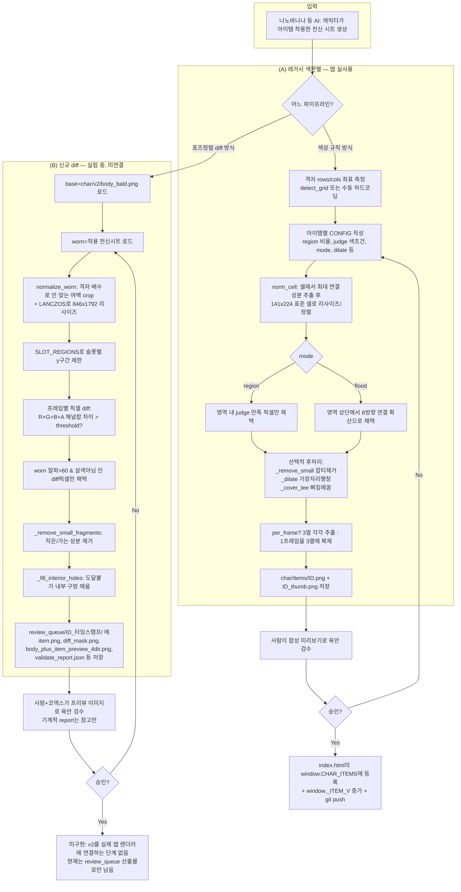

# Murpy World — 장비(의상/아이템) 추출 파이프라인 완전 문서화

> 목적: 현재 구현을 코드 없이도 재구현 가능한 수준으로 정확히 문서화. 개선 제안 없음, 현재 동작만 기술.
> 대상 리포지토리: `C:\Users\won\Murpy` (단일 HTML 웹앱 + Python 오프라인 이미지 파이프라인)
> 작성 시점: 2026-07-09. 리포지토리에는 **두 세대의 파이프라인**이 공존한다 — (A) 레거시 "색/영역 판별" 방식(현재 앱에 실제 등록된 아이템들이 이 방식으로 만들어짐), (B) 신규 "동일 포즈 풀스프라이트 diff" 방식(현재 활발히 반복 실험 중, 아직 앱 미연결). 둘 다 아래에 각각 설명한다.

---

## 0. 큰 그림 (레이어 합성 모델)

앱은 캐릭터를 **레이어 스택**으로 렌더링한다. 최종 화면에 보이는 캐릭터 = 여러 개의 투명 PNG 스프라이트시트를 z-order대로 겹친 것.

- 레이어 순서(뒤→앞): `body → bottom → shoes → top → hair → hat → accessory`
- 각 레이어는 **동일한 그리드 규격의 스프라이트시트 PNG**(3열×4행, 아래에서 정의)이며, 서버가 아니라 **브라우저 CSS background-position**으로 프레임을 오려서 보여준다(`index.html`의 `_charEquippedSheets`, `_CHAR_LAYER_ORDER`).
- "아이템 추출"이란: 사람이 실제로 그 옷을 입은 전신 시트(AI 생성 이미지)에서, **몸/얼굴/맨몸 픽셀은 모두 지우고 옷 픽셀만 남긴 투명 PNG 레이어**를 만들어내는 작업이다.

두 파이프라인의 핵심 차이:

| | (A) 레거시 색판별(`extract_item.py` 계열) | (B) 신규 diff(`customizer_cli.py extract-diff`) |
|---|---|---|
| 그리드 규격 | 423×896, 셀 141×224 | 846×1792, 셀 282×448 (2배 고해상도) |
| 아이템 판별 원리 | 픽셀의 **색상값**(RGB 임계값)으로 "이건 모자/바지/신발 색이다"를 규칙으로 판정 | 같은 포즈의 "맨몸 기준시트"와 "착용시트"를 **같은 좌표끼리 픽셀 diff** → 차이 나는 곳 = 착용 아이템 |
| 입력 | 아이템 착용 전신시트 1장만 | 기준 맨몸 시트(`char/v2/body_bald.png`) + 착용 전신시트 2장 |
| 현재 상태 | **앱에 실사용 중**(`window.CHAR_ITEMS`에 등록됨) | 실험 중, `review_queue/`에 산출물만 쌓임. 앱 미연결 |
| 검수 | 사람이 직접 눈으로(합성 미리보기 파일 생성 스크립트도 있음) | `customizer_cli.py`가 기계적 검증 리포트(JSON) 자동 생성 + 미리보기 자동 생성 |

---

## 1. 전체 워크플로우 — 처음부터 끝까지

### 1-A. 레거시 파이프라인 (색상 규칙 기반, 현재 실사용)

```
[사람] 나노바나나(이미지 생성 AI)로 "우리 캐릭터가 XX 아이템을 착용한 4방향 전신 시트" 생성
        (배경 제거된 Photoroom PNG로 받음, 임의 해상도, 임의 격자 간격)
   │
   ▼
[클로드코드] extract_item.py 를 실행하기 위해:
   1) 소스 이미지의 그리드(4행×3열) 좌표를 알아냄
      - detect_grid()로 자동 측정 시도 (알파채널 투영으로 밴드 검출)
      - 또는 사람이 눈으로 보고 CONFIG.rows/cols 좌표를 수동 하드코딩
   2) 아이템 종류별로 CONFIG 딕셔너리 작성:
      - region: 그 아이템이 존재하는 셀 내 세로 비율 구간 (예: 모자=0.02~0.33, 바지=0.50~0.90)
      - judge 함수: 픽셀 RGBA → "이건 아이템 색이다/아니다" boolean 판정 함수
      - mode: "region"(영역 내 색조건 픽셀만) 또는 "flood"(영역 상단에서부터 조건 만족 픽셀을 8방향 연결로 채움)
      - per_frame: 상의/하의처럼 팔다리가 움직여 프레임마다 모양이 다른가(True) / 모자처럼 3프레임 동일 복제할까(False)
      - dilate / min_component / cover_tee 등 후처리 옵션
   3) python extract_item.py (또는 build_bermuda.py, build_shoes_black.py 같은 아이템 전용 래퍼) 실행
   │
   ▼
[extract_item.build()] 내부 처리 (4행 × (1 or 3열) 반복):
   a) norm_cell(): 소스의 해당 셀에서 "가장 큰 연결 성분"(캐릭터 실루엣)을 찾아
      우리 표준 셀(141×224, 키 214px, 바닥 정렬)로 리사이즈·정규화
   b) extract(): 정규화된 셀 위에서 judge()/mode에 따라 아이템 픽셀만 추출
   c) (옵션) _remove_small(): 작은 잡티(디컴포넌트) 제거
   d) (옵션) _dilate(): 가장자리 n픽셀 팽창(밑에 옷이 비치는 것 방지)
   e) (옵션) _cover_tee(): 기본 파란 티셔츠가 비어져 나온 픽셀을 인접 아이템색으로 번지게 채움
   f) per_frame=False면 프레임0 결과를 3열에 그대로 복제, per_frame=True면 3열 각각 따로 추출
   │
   ▼
[출력] char/items/<name>.png (423×896, walk.png와 동일 규격) + <name>_thumb.png(정면 프레임 알파 크롭 썸네일)
   │
   ▼
[사람] 눈으로 검수 (자동 합성 미리보기 스크립트 실행 후 이미지로 확인, 또는 브라우저 customizer 도구로 확인)
   │
   ▼
[클로드코드] 승인되면 index.html의 window.CHAR_ITEMS 배열에 {id, slot, name, price, sheet, thumb} 등록
             + window._ITEM_V (캐시버전) 값 증가 → git push
```

### 1-B. 신규 diff 파이프라인 (포즈 정렬 diff 기반, 실험 중)

```
[사람] 나노바나나로 "우리 캐릭터(민머리 기준 바디)가 XX를 착용한 고해상도 전신시트" 생성
        img2img 방식 — 같은 캐릭터·같은 포즈를 유지한 채 옷만 새로 그리게 유도
   │
   ▼
[클로드코드] customizer_cli.py extract-diff 실행
   --base   char/v2/body_bald.png   (맨몸 기준 시트, 846×1792 고정)
   --worn   <생성된 착용 시트>        (해상도 임의)
   --slot   hat|hair|top|bottom|shoes|accessory
   --item-id <이름>
   --threshold 85 (기본)
   │
   ▼
[extract-diff 내부 처리]
   1) normalize_worn(): worn 이미지가 base와 크기가 다르면
      - 격자 배수(cols/rows)로 안 나눠떨어지는 나머지 영역을 "여백이 더 빈 쪽"에서 crop
      - LANCZOS로 base_size(846×1792)에 강제 리사이즈
   2) SLOT_REGIONS 표에 정의된 슬롯별 세로 비율 구간(y0~y1)으로 diff 대상 영역 제한
      예: top=(0.30, 0.84), bottom=(0.55, 0.93), shoes=(0.84, 1.00), hat=(0.00, 0.40)
   3) 4행×3열 각 프레임에 대해, 동일 (x,y) 좌표에서
      d = |R_base-R_worn| + |G_base-G_worn| + |B_base-B_worn| + |A_base-A_worn|
      d > threshold(85) 인 픽셀만 "차이남" 판정
   4) 차이나는 픽셀 중 worn쪽 알파>60 이고 살색 판정(_is_skin)이 아닌 것만 아이템 픽셀로 채택
   5) _remove_small_fragments(): 22px 미만 연결성분, 가늘고(2px 이하 폭/높이) 140px 미만인 성분 등을 잡음으로 간주해 제거
   6) _fill_interior_holes(): 가장자리에서 도달 불가능한 내부 투명 구멍을 최근접 아이템색으로 채움(가랑이 사이 같은 "진짜 뚫린 곳"은 가장자리에서 도달 가능하므로 보존)
   │
   ▼
[출력] tools/character-customizer/review_queue/<item-id>_<타임스탬프>/ 폴더에:
   - source_original.png, source_normalized_v2.png (정규화 전/후 착용시트)
   - diff_mask.png (어디를 차이로 판정했는지 빨간 반투명 오버레이)
   - item.png (최종 추출된 아이템 레이어, 846×1792)
   - thumb.png (제공된 썸네일 있으면 그것, 없으면 정면 프레임 알파 자동크롭)
   - body_plus_item_preview_4dir.png (기준 바디 위에 아이템을 겹친 4방향 합성 미리보기)
   - item_only_preview.png (아이템만, 마젠타 배경 위에)
   - validate_report.json (기계적 검증 결과)
   - request.md (검수 요청 메모, "아직 앱 등록 안 함" 명시)
   │
   ▼
[사람 + 코덱스] 프리뷰 이미지를 보고 시각적으로 OK/NG 판정 (자동화 없음)
   │
   ▼
(NG) 사람이 나노바나나로 재생성하거나 threshold/파라미터를 바꿔 재실행 → 다시 review_queue에 새 타임스탬프 폴더 생성 → 반복
(OK) 아직 이 리포지토리에는 "v2를 실제 앱에 연결"하는 단계가 구현되어 있지 않음(murpy_layers_v2.json은 앱 렌더러가 아니라 검수 CLI 전용 매니페스트). 문서(ITEM_PRODUCTION_PIPELINE.md)상 다음 단계는 "승인 후 char/items에 복사 + index.html CHAR_ITEMS 연결"이지만 v2 항목은 아직 이 마지막 연결이 이뤄진 적 없음.
```

---

## 2. 각 단계에서 생성되는 파일

### 레거시 (A)
| 단계 | 파일 |
|---|---|
| 입력 | `C:\Users\won\Desktop\...\아이템착용스프라이트시트\*.png` (임의 해상도 소스) |
| 출력 | `char/items/<id>.png` (423×896), `char/items/<id>_thumb.png` |
| 등록 | `index.html`의 `window.CHAR_ITEMS` 배열 항목 + `window._ITEM_V` 정수 증가 |

### 신규 (B)
| 단계 | 파일 |
|---|---|
| 입력 | `char/v2/body_bald.png` (기준), 임의 해상도 착용 소스 |
| 산출 폴더 | `tools/character-customizer/review_queue/<item-id>_<YYYYMMDD-HHMMSS>/` |
| 그 안 파일 | `source_original.png`, `source_normalized_v2.png`, `diff_mask.png`, `item.png`, `thumb.png`, `body_plus_item_preview_4dir.png`, `item_only_preview.png`, `validate_report.json`, `request.md` |
| 앱 연결 | **미구현** — 최종적으로 `char/v2/*`와 `murpy_layers_v2.json`은 있으나, 이 v2 아이템들을 `index.html`의 실제 렌더러가 읽는 경로는 아직 없음. |

---

## 3. 사용 중인 라이브러리 / 알고리즘

- **라이브러리**: Python 표준 `collections.deque`, `collections.Counter`, 그리고 오직 **Pillow(PIL)** 하나. OpenCV·NumPy·ImageMagick 등은 전혀 쓰지 않는다. 모든 픽셀 반복은 `im.load()`로 얻은 `PixelAccess` 객체를 이중 for문으로 순회하는 **순수 파이썬 픽셀 루프**다(벡터화 없음).
- **알고리즘 목록**과 실제 사용처:
  - **RGB/HSV류 임계값 판정(수작업 색상 규칙)**: 모든 `is_xxx(px)` 함수들(`is_item_cap`, `gray_judge`, `shoe_judge`, `is_top_seed`, `is_blue_shirt`, `is_hair_fill`, `is_skin_like` 등). "채도(chroma = max-min)"와 "밝기(max/min of r,g,b)"를 조합한 조건문. 진짜 HSV 변환은 안 하고 RGB에서 근사.
  - **알파 임계값**: 투명 여부는 항상 `a < 어떤값` (20, 40, 60, 90 등 함수마다 제각각)으로 판정. 통일된 상수 없음.
  - **8-방향 Connected Component (BFS/flood fill, 직접 구현)**: `extract_item.largest()`, `_extract_flood()`, `_remove_small()`, `build_walk.largest()`, `customizer_cli._remove_small_fragments()`, `extract_hair_layer.component_from_seeds()`. OpenCV의 `connectedComponents`를 안 쓰고 `deque` 기반 BFS를 매번 새로 작성.
  - **Region 기반 마스킹**: 셀의 세로 비율 구간(y0~y1)만 스캔 (`_extract_region`, `mask_cell`, `SLOT_REGIONS`). "이 아이템은 대략 셀의 몇 %~몇 % 위치에 있다"는 **사람이 미리 정한 값**.
  - **Morphological dilation(직접 구현)**: `_dilate()` — OpenCV dilate가 아니라, 알파<40인 픽셀에 대해 3×3 이웃 중 "채도가 가장 높은" 이웃 색을 채워 넣는 커스텀 팽창. `solid=True`면 최빈색(대표색)으로 채움.
  - **Seed-and-grow(시드 확산) 결합 방식**: `extract_top_v2.clean_cell()`, `extract_basic_outfit_v2.mask_cell()` — 먼저 엄격한 색 조건(seed)으로 코어 영역을 잡고, 그 주변에 한해 완화된 "외곽선 후보" 조건을 허용(`near_mask`/`has_seed_near`로 반경 내 근접 여부 확인). 이는 사실상 **제한적 region growing**.
  - **픽셀 diff(프레임 정합 전제)**: `customizer_cli.cmd_extract_diff()` — OpenCV의 `absdiff`에 해당하는 걸 채널별 절대값 합으로 직접 계산.
  - **flood-fill from border(배경 판별)**: `build_walk.build()`(비-alpha 소스일 때 배경색 판정 후 테두리에서 flood), `normalize_sprite_sheet.remove_edge_checker()`(체커보드 배경 제거).
  - **최빈색(mode color) 계산**: `Counter` 기반 `_dominant()`, `dominant_blue()` — dilate/fill 시 채울 대표색을 정할 때.
  - **Bounding-box 알파 크롭**: `getbbox()` — 썸네일 생성 시 여백 제거.
  - **LANCZOS 리샘플링**: 모든 리사이즈(`Image.LANCZOS`/`Image.Resampling.LANCZOS`)에 사용. 다른 보간법(bilinear, nearest 등) 없음.
  - **격자 좌표 하드코딩**: 소스 그리드(rows/cols 픽셀 좌표)는 `detect_grid()`로 자동 측정하거나, 대부분 스크립트에서 **사람이 미리 측정해 CONFIG에 박아 넣은 상수**. 소스가 바뀌면 이 좌표도 다시 사람이 재측정해야 함.
  - **OpenCV, 딥러닝 세그멘테이션(SAM 등), contour 추적, 클러스터링**: **전혀 사용하지 않음.**

---

## 4. 장비(아이템) 영역은 어떻게 검출되는가

두 갈래로 다르다.

- **(A) 레거시**: 검출이라기보다 "**사람이 정한 좌표 구간 + 색상 규칙**"의 교집합이다. 예:
  - 모자: 셀의 위쪽 2%~33% 구간에서, "무채색이고 어두움(검정)" 또는 "밝고 무채색(흰/크림)"인 픽셀.
  - 버뮤다 팬츠: 셀의 50%~90% 구간에서, 채도≤24 & 밝기 92~216(회색).
  - 신발: 셀의 87%~100% 구간에서, 살색이 아닌 불투명 픽셀 전부.
  - "영역"은 아이템 종류마다 사람이 시각적으로 보고 추정한 비율값이며, 코드가 자동으로 옷의 경계를 찾는 게 아니다.
  - 예외적으로 `mode="flood"`(예: 모자류)는 영역 상단에서 시작해 판정 조건을 만족하는 픽셀들을 8방향으로 연결 확산시켜 "위에서부터 이어진 덩어리"만 채택 — 이러면 모자 밑단이 실제 아치형 곡선을 따라가지만, 대신 조건을 만족하는 색이 위에서부터 끊김없이 이어져야 한다는 전제가 필요.
- **(B) 신규 diff**: 영역 검출이 곧 "**기준 맨몸과 다른 픽셀**"이다. 사람이 정한 것은 오직 슬롯별 대략적 세로 구간(`SLOT_REGIONS`, 예: top=몸통의 30~84%)뿐이고, 그 구간 안에서 "차이 나는 곳 = 아이템"이라는 원리로 자동 검출한다. 색상 규칙이 필요 없다는 게 (A)와의 핵심 차이.

두 방식 모두 **"진짜 의류의 기하학적 경계(옷깃, 소매 끝, 밑단 라인)"를 능동적으로 추론하지 않는다.** (A)는 색이 조건을 만족하는 한 그 픽셀을 아이템으로 보고, (B)는 기준 이미지와 다르기만 하면 아이템으로 본다.

---

## 5. 배경은 어떻게 제거되는가

- **소스 자체가 이미 배경 제거된 투명 PNG로 온다**는 전제가 있다("Photoroom" 서비스로 사람이 미리 배경을 지워서 제공). 파이프라인 코드 자체는 "배경을 지우는" 별도 알고리즘을 아이템 추출 시 돌리지 않는다 — 이미 알파채널이 있는 걸 그대로 신뢰한다.
- 예외 1: `build_walk.py`의 non-alpha 경로(현재는 `alpha=True`만 CONFIGS에 있어 비활성) — 단색 배경(`BG`)과 허용오차(tol=78) 안에 드는 색을 테두리부터 8방향 flood-fill로 전파시켜 배경 마스크를 만들고, 3×3 침식(모든 이웃이 배경이어야 배경으로 확정)까지 적용.
- 예외 2: `normalize_sprite_sheet.py`의 `remove_edge_checker()` — 알파<20 이거나 "채도≤8이고 밝기≥145"(연한 회색/흰색 체커보드 패턴 색)인 픽셀을 테두리에서부터 4방향 flood-fill로 제거.
- 신규 diff 방식(B)은 "배경 제거"라는 개념 자체가 없다 — 애초에 기준 바디와 다른 부분만 남기므로, 기준 바디의 배경(투명)과 착용시트의 배경(투명)이 같으면 diff=0이라 자동으로 걸러진다.

---

## 6. 오탐(false positive) 픽셀은 어떻게 제거되는가

- **작은 연결성분 제거**: `_remove_small(item, minsz)` (A), `_remove_small_fragments()` (B) — BFS로 8방향 연결성분을 구하고, 픽셀 수가 임계값 미만이면(또는 가늘고 긴 형태면) 통째로 지움. "눈 하이라이트 잔여 도트", "diff 스캔 노이즈" 등을 이렇게 제거한다고 주석에 명시.
- **살색 배제**: `is_skin` 계열 함수(여러 벌 존재, 스크립트마다 임계값이 조금씩 다름)로 "이건 피부색이니 아이템이 아니다"를 별도로 재확인.
- **네거티브 색상 조건**: 예를 들어 모자 판정에서 "갈색 머리(r>b 큼)는 제외", 신발 판정에서 "발목 스킨(r>110 & r>g+20 & r>b+35)은 제외".
- **영역 제한 자체가 오탐 방지 수단**: 셀의 특정 y 비율 구간 밖은 애초에 안 봄(예: 신발 판정을 발끝 87~100%로 좁혀서 남색 반바지를 신발로 오인하던 버그를 해결한 `build_shoes_black.py`의 코멘트가 이를 명시).
- **diff 임계값(threshold)**: (B)에서 채널합 차이가 85 미만이면 "같다"고 보고 버림 — 안티앨리어싱/약한 그림자 차이 등 미세한 렌더링 잡음을 무시하기 위함.
- 사람이 사후에 그림을 보고 "이 부분이 잘못됐다"고 판단하면, **코드 규칙 자체를 다시 손으로 좁히거나 넓혀서 재실행**하는 방식으로 수정한다(자동 학습/피드백 루프 없음). 예: git 로그의 "회색버뮤다·검정러닝화 추출 버그 수정"(회색 판정이 모자 챙 회색과 겹쳐 오인식 → region 재조정), "LA 다저스 모자 재추출(로고 제거)".

---

## 7. 장비 경계(윤곽)는 어떻게 결정되는가

- **경계를 직접 추적하는 로직은 없다.** "이 픽셀이 조건에 맞는가"를 픽셀 단위로 독립 판정할 뿐, contour tracing이나 엣지 검출(Canny 등)은 안 쓴다. 결과적으로 보이는 경계는:
  - (A) region 모드: 판정 조건을 만족하는 픽셀들의 산발적 집합의 바깥 테두리 = 결과 경계. 조건이 딱 맞지 않으면 경계가 들쭉날쭉해질 수 있음.
  - (A) flood 모드: 위에서부터 연결된 하나의 덩어리의 경계 = 아치형 밑단처럼 자연스러운 곡선이 나옴(모자에 적합했던 이유).
  - (B) diff 모드: "기준과 다른 영역"의 바깥 테두리. 원본 착용시트에서 옷이 그려진 그 경계를 (변형 없이) 그대로 물려받음 — 대신 기준 바디와 착용 바디의 포즈/체형이 완벽히 일치해야만 경계가 깨끗하게 나옴.
- 이후 `_dilate()`(A)로 경계를 1~2px 강제로 팽창시켜 "밑에 옷이 비치는" 문제를 덮거나, `_fill_interior_holes()`(B)로 경계 안쪽의 뚫린 구멍만 메꾸는 식의 **사후 보정**이 경계를 다듬는 역할을 겸한다.

---

## 8. 결정론적(deterministic) 단계 vs AI 추론에 의존하는 단계

| 단계 | 성격 |
|---|---|
| 원본 소스 이미지 생성 (나노바나나로 "캐릭터가 XX 착용한 시트" 그리기) | **AI 생성, 비결정적.** 매번 다른 그림이 나올 수 있고, 포즈/비율/색이 조금씩 달라짐 |
| 격자 좌표 측정(rows/cols) | 대부분 **사람이 눈으로 측정해 하드코딩**(자동 `detect_grid()`도 있으나 보조적) |
| judge 함수 색상 규칙, region 비율, threshold 값 | **사람이 설계한 결정론적 규칙**(코드) — 같은 입력이면 항상 같은 출력 |
| BFS 연결성분, dilate, hole-fill, diff 계산 | **완전히 결정론적**인 순수 알고리즘 |
| 결과가 "옷처럼 보이는가" 최종 판단 | **AI 추론 없음 — 사람의 눈(비전)에 전적으로 의존.** 코드는 오직 크기/투명도/살색유무 같은 기계적 지표만 확인하고, "시각적으로 자연스러운가"는 검증하지 못함 |
| Codex(다른 LLM)가 프리뷰 이미지를 보고 "여기 로고 지워라" 같은 수정 스펙 작성 | **AI(비전) 추론** — 그러나 이건 파이프라인 코드 밖에서, 사람 역할을 일부 대신하는 것 |

핵심: **"진짜로 옷처럼 보이는가"를 판단하는 유일한 단계는 사람(또는 사람을 흉내내는 별도 LLM 비전 검수)이고, 파이프라인 코드 자체에는 그런 지각적 판단이 전혀 없다.** `validate_report.json`의 `"ok": true`는 "크기 맞음/투명 있음/피부색 없음/빈 프레임 없음"만 의미하며 "옷이 자연스럽게 보임"을 보장하지 않는다 (증거: 아래 11번 항목).

---

## 9. 알고리즘이 전제하는 가정들

1. **소스가 이미 우리 캐릭터 비율로 그려졌다는 가정.** (즉 옷 시트를 그린 AI가 우리 캐릭터의 실제 몸 비율·머리 크기를 지켰다는 전제. `feedback_murpy_worn_sheet_proportions` 메모에 남아있듯, 다른 비율로 그려지면 옆모습에서 머리가 튀어나오는 등 실패.)
2. **격자가 균등하고, 사람이 측정한 좌표가 정확하다는 가정.**
3. **(A) 색 조건이 "그 아이템류의 전형적인 색"과 "몸의 다른 부위 색"을 확실히 구분할 수 있다는 가정.** (같은 회색이라도 모자 챙과 바지가 섞이면 실패 — 실제로 발생한 버그.)
4. **(A) region의 세로 비율 구간이 모든 프레임/방향에서 동일하다는 가정.** 옆모습에서는 실제 아이템 위치가 정면과 다를 수 있는데 동일 y구간을 적용.
5. **(B) diff 방식은 기준(base) 사진과 착용(worn) 사진이 "완전히 동일한 포즈·카메라·체형"이라는 가정.** 조금이라도 포즈가 달라지면(팔 각도, 다리 벌림 정도 등) 옷이 없는 곳까지 diff로 잡히거나, 옷이 있는 곳이 diff에서 빠짐.
6. **(B) `normalize_worn()`은 원본이 목표 그리드 배수에 딱 안 맞을 때 "여백 있는 가장자리를 자른다"는 가정** — 즉 "안 맞는 나머지 부분은 여백이지 콘텐츠가 아니다"라는 전제. 옷이 캔버스 가장자리까지 그려졌으면 이 crop이 옷을 잘라먹을 수 있음.
7. **"살색이 아니면 다 아이템"(diff 방식) 이라는 가정.** 그림자·머리카락·액세서리 등 살색이 아닌 다른 신체 파츠가 같이 diff에 걸리면 그대로 아이템으로 오염됨.
8. **판정 임계값(색 범위, threshold=85, minsz 등)은 "지금까지 본 아이템들"에 맞춰 튜닝된 값**이라, 새로운 색/형태의 아이템에는 안 맞을 수 있음 — 매번 사람이 재조정.

---

## 10. 왜 모자·비니는 성공하고 셔츠·오버사이즈 의류는 실패하는가

git 커밋 로그와 `review_queue/`의 반복 횟수(`top_jersey`, `top_ringer`는 같은 날 5회, 6회씩 재시도된 반면 모자류는 상대적으로 적음)로 볼 때, 실패 패턴은 다음으로 설명된다:

1. **면적/변형량 차이**: 모자·비니는 머리 위 작은 영역에, 걸음 동작과 무관하게 거의 고정된 위치·형태로 존재한다. 셔츠(특히 저지·후드처럼 헐렁한 상의)는 몸통 전체를 덮고, 팔 움직임(idle/walk1/walk2)마다 소매·밑단의 형태가 크게 달라진다.
   - (A) region 방식: 모자는 "셀 위쪽 2~33%"라는 좁고 안정적인 구간 하나로 커버되지만, 셔츠는 y구간이 넓어(0.30~0.84 등) 팔·몸통·바지 경계와 겹치는 영역이 넓어지고, 프레임마다(`per_frame=True`) 소매 위치가 달라 같은 색 규칙이라도 노출되는 살/배경 면적이 프레임마다 달라진다.
   - (B) diff 방식: 모자는 머리 실루엣과 겹치는 부분이 작고 포즈 영향을 거의 안 받지만, 셔츠는 팔이 움직이며 base(맨몸)와 worn(착용) 사이의 **팔 각도 자체가 미세하게 달라지기 쉬워** diff가 소매 경계에서 어긋난다. 실제로 `top_jersey`의 `diff_mask.png`를 보면 옆모습(3·4행)에서 프레임(열)마다 소매 마스크 모양이 서로 다르게 끊기거나 확장되는 게 관�察됨.
2. **색상 대비**: 모자(검정/흰)와 비니는 피부색·머리색과 색상 대비가 크다. 반면 남색 반바지 vs 검정 신발(둘 다 어두운 무채색), 파란 티셔츠 vs 파란 후드줄 같은 경우처럼, **비슷한 색끼리는 (A)의 RGB 임계값 규칙이 서로를 침범**한다(실제 버그: 회색 버뮤다 판정이 모자 회색 챙까지 먹거나, 검정 신발 판정이 남색 반바지를 삼킴).
3. **로고·텍스트·패턴이 있는 의류**: `top_jersey`("LEGEND", "77", 방패 로고)처럼 다색·고대비 패턴이 있으면, 색상 임계값 규칙(A) 자체가 안 맞고, diff 방식(B)도 그 로고 부분에서 안티앨리어싱 경계가 threshold 근처를 오가며 지글거리는 경계(fringing)를 만든다.
4. **길이가 긴 의류(오버사이즈, 무릎까지 오는 후드 등)**: region 방식은 애초에 "셔츠는 대략 몸통 %구간"이라는 사람이 정한 고정 비율 가정을 쓰는데, 기장이 길어지면 이 비율을 벗어나 하반신 영역(바지 region)과 겹쳐버려 서로 다른 슬롯끼리 픽셀을 나눠 갖는 충돌이 생긴다.
5. **검증 리포트가 "시각적 실패"를 못 잡음(8번 항목)**: `validate_report.json`은 크기/투명/살색 유무만 체크하므로, `top_jersey`처럼 매크로 구조(소매가 이상하게 잘림, 옆모습에서 하반신이 허공에 뜬 것처럼 보임)가 잘못돼도 `"ok": true`로 통과한다 — 그래서 같은 아이템이 같은 결과로 여러 번(같은 날 5~6회) 재시도되는 일이 반복된다.

---

## 11. 알려진 실패 사례 목록 (git 로그 + review_queue 근거)

- **회색 버뮤다 팬츠**: 회색 판정이 "모자(GBD캡) 챙 색"을 오추출 → 재추출로 수정(`build_bermuda.py` 주석, 커밋 `5e51db0`).
- **검정 러닝화**: 검정 판정식이 "짙은 남색 반바지"까지 신발로 오인 → 신발이 정강이까지 길어지고 발목이 반투명 구멍처럼 보임 → region을 발끝(0.87~1.00)으로 좁히고 살색 제외 조건 추가(`build_shoes_black.py` 주석, 커밋 `5e51db0`).
- **LA 다저스 모자**: 다른 AI가 그린 시트가 "우리 캐릭터 비율"이 아니어서 옆모습에서 챙/로고가 튀어나옴 → 새 시트로 교체해도 문제 반복 → 결국 앱에서 제거(v2 레이어로 재작업 예정, 커밋 `70a95e2`, `b0e8656`, `0434e45`).
- **후드(레드 후디)**: 기본 파란 티셔츠가 후드 밑에서 삐져나와 파란 줄처럼 보임 → 여러 차례 시도(빨강으로 덮기 → 근접 아이템색 번짐 채우기 → 결국 "후드가 삐져나온 티셔츠를 직접 덮게" 근본 대응, 커밋 `091affc`, `1cc56c8`, `b3a455b`).
- **에어팟(액세서리)**: 옆 이어컵이 기하 마스크 처리 중 사라짐 → 복원, 눈 하이라이트 도트가 잔여 아이템 픽셀로 잘못 포함됨 → `_remove_small`류로 제거(커밋 `e4e07f5`, `4c85041`).
- **비니**: 밑단이 부자연스러운 드립(늘어짐) 모양으로 나옴 → flood 임계 조정으로 완화(커밋 `4c85041`).
- **제미나이(생성 AI) 워터마크(✦)**: 배경/필드 이미지에 워터마크가 그대로 남아 별도 제거 작업 필요(캐릭터 아이템은 아니지만 같은 "AI 생성물 후처리" 클래스의 실패, 커밋 `29a5204`).
- **2배 고해상도 재빌드 전체**: 아이템 9종을 2배로 재추출했으나 실제 앱에 적용 후 "아이템이 안 맞음" 이슈로 전체 되돌림(revert, 커밋 `3decde9`) — 즉 **같은 추출 로직이라도 해상도가 바뀌면 좌표/임계값 가정이 깨짐**을 보여주는 사례.
- **(B) top_jersey / top_ringer**: 2026-07-09 하루에만 top_jersey 5회, top_ringer 6회, hat_ladodgers 3회, bottom_trainpt 4회, bottom_bermuda 2회 반복 추출 — 매번 `validate_report.json`은 `"ok": true`를 반환했지만(살색 없음, 빈 프레임 없음, 크기 정상), `diff_mask.png`를 보면 옆모습(3·4행)에서 프레임(열)마다 소매/몸통 마스크 형태가 들쭉날쭉 달라지는 것이 관찰되어, 결과물의 시각적 자연스러움과 무관하게 반복 재시도가 이뤄지고 있음을 시사한다.

---

## 12. 어느 단계가 가장 큰 오류의 원천인가

1위: **"사람이 미리 정한 색상 임계값/영역 비율 규칙"(A)과 "포즈 완전 일치를 전제한 픽셀 diff"(B) 둘 다, 원본 AI 생성 이미지의 변동성(포즈·비율·색·로고)을 흡수하지 못하는 것.** 두 파이프라인 모두 "이번 소스 이미지가 지난번과 구조적으로 같다"는 전제 위에 만들어진 하드코딩 규칙이라서, 소스가 조금만 달라져도(다른 캐릭터 비율, 다른 포즈, 새로운 색·로고) 깨진다.

2위(결과적으로 체감상 더 큰 문제): **검증 단계의 부재/얕음.** `validate_report.json`이 확인하는 지표(크기, 투명도 존재, 살색 없음, 빈 프레임 없음)는 전부 "명백한 사고"만 잡을 뿐 "옷이 이상하게 보인다"는 못 잡는다. 그 결과 시각적으로 실패한 결과물도 기계적으로는 계속 "ok"가 나오고, 실제 판정은 전적으로 사람 눈에 의존하면서 같은 아이템을 파라미터만 살짝 바꿔 반복 재생성하는 비효율(top_jersey 5회 등)이 발생한다.

---

## 13. 전체 워크플로우 플로우차트



---

## 14. 다른 AI 엔지니어가 처음부터 재현할 수 있는 아키텍처 요약

### 필요한 사전 정의(표준)
```
표준 그리드(레거시): 캔버스 423x896, 셀 141x224, 3열(idle,walk1,walk2) x 4행(down,up,left,right)
표준 그리드(v2, 고해상도): 캔버스 846x1792, 셀 282x448, 동일 3x4 배치
레이어 순서(뒤→앞): body, bottom, shoes, top, hair, hat, accessory
```

### 파이프라인 재현에 필요한 구성요소 5가지

1. **그리드 파서**: 입력 이미지에서 4행×3열 셀 경계 좌표를 얻는 함수.
   - 자동: 알파채널을 각 행/열 방향으로 투영(sum of alpha>threshold)해 "값이 일정 폭 이상 연속되는 구간"을 밴드로 검출.
   - 수동 폴백: 좌표 상수를 코드에 하드코딩(신뢰도 낮지만 실무에서 더 많이 쓰임).

2. **셀 정규화기**: 각 셀 내부에서 "가장 큰 8방향 연결 성분"(=캐릭터 실루엣, 알파 임계 40 정도)을 찾아 bbox로 자르고, 목표 키(예 214px)에 맞춰 LANCZOS 리사이즈 후 표준 셀 캔버스에 바닥 정렬로 붙여넣는다. (이렇게 해야 소스마다 캐릭터 크기가 달라도 항상 같은 위치/크기로 맞출 수 있음.)

3. **아이템 판별기 — 둘 중 택1(또는 병행)**
   - (a) **색상 규칙 판별기**: `judge(r,g,b,a) -> bool` 함수 + "셀 세로 비율 구간" 두 개를 아이템 종류별로 사람이 정의. `region` 모드(구간 내 무조건 판정) 또는 `flood` 모드(구간 상단에서 8방향 연결 확산)로 픽셀 채택.
   - (b) **기준-차이(diff) 판별기**: 완전히 동일 포즈의 "맨몸 기준 이미지"가 반드시 있어야 함. 같은 좌표의 RGBA 채널 절대차 합이 임계값(예 85)을 넘는 픽셀만 채택하고, 살색 판정 함수로 한 번 더 걸러낸다. 슬롯별 대략적 y구간으로 탐색 범위를 제한.

4. **후처리 정리기(공통)**
   - 8방향 연결성분 크기 기반 잡티 제거(임계 픽셀 수 미만이면 삭제, 가늘고 긴 형태는 더 엄격하게).
   - 가장자리에서 flood-fill로 도달 가능한 영역과 불가능한(막힌) 내부 영역을 구분해, 막힌 내부 투명 구멍만 최근접 색으로 메움.
   - (선택) 가장자리 n픽셀을 채도 높은 이웃색(또는 최빈색)으로 팽창시켜 언더레이어가 비치는 문제를 덮음.

5. **조립·검증기**
   - per_frame 여부에 따라 3열을 각각 처리하거나 1열 결과를 복제.
   - 출력 PNG를 표준 캔버스 크기로 저장 + 정면 프레임 알파bbox 크롭으로 썸네일 생성.
   - 기계적 검증: 크기 일치, 투명 영역 존재, 불투명 영역 존재(빈 프레임 아님), 살색 픽셀 없음, 4방향×3프레임 모두 내용 있음 — 이 다섯 가지를 JSON 리포트로 남김.
   - **이 기계적 검증은 "옷처럼 보이는지"를 보장하지 않으므로, 반드시 사람(또는 별도 비전 모델)이 합성 미리보기 이미지를 직접 보고 승인하는 단계를 파이프라인 마지막에 강제해야 한다.** 이 프로젝트는 그 승인 이전에는 앱의 실데이터(index.html)에 절대 연결하지 않는 게이트를 문서(ITEM_PRODUCTION_PIPELINE.md)로 강제하고 있다.

### 핵심 설계 교훈(재현 시 반드시 반영)
- 색상 규칙 방식은 **아이템 색이 신체의 다른 부위 색과 충분히 다를 때만** 안정적이다. 대비가 약하거나(무채색끼리), 로고/패턴이 섞이면 깨진다.
- diff 방식은 **입력 두 장의 포즈가 픽셀 단위로 정확히 일치해야** 안정적이다. 헐렁한 옷·팔다리 움직임이 큰 프레임일수록 어긋난다.
- 어느 방식이든 "판정 파라미터(색 범위, 비율 구간, threshold)"는 **아이템마다 사람이 새로 튜닝**해야 하며, 하나의 만능 설정은 없다.
- 기계적 검증과 시각적 검증은 별개이며, 전자를 통과했다고 후자가 보장되지 않는다는 점을 시스템 설계에 명시적으로 반영해야 한다(현재 리포지토리는 이걸 "사람이 프리뷰를 본다"는 수작업 게이트로만 해결하고 있음).
