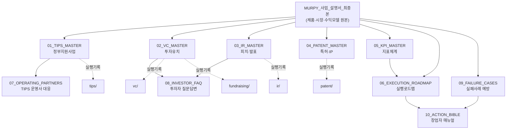

# MASTER INDEX — MURPY 사업 지식베이스 전체 지도

> 이 문서가 모든 것의 시작점이다. 다른 문서를 읽기 전에 이 문서로 전체 구조를 파악한다.

---

## 1. 문서 진행 현황

| # | 문서 | 상태 | 우선순위 | 최종 갱신 |
|---|---|---|---|---|
| 00 | `MURPY_사업_설명서_최종본.md` (상위 폴더) | 완료 (Final v2.0) | — | 2026-07-17 |
| 01 | `master/01_TIPS_MASTER.md` | 완료 (v1.0) | 최우선 | 2026-07-21 |
| 02 | `master/02_VC_MASTER.md` | 완료 (v1.0) | 높음 | 2026-07-21 |
| 03 | `master/03_IR_MASTER.md` | 완료 (v1.0) | 높음 | 2026-07-21 |
| 04 | `master/04_PATENT_MASTER.md` | 미작성 | 중간 | — |
| 05 | `master/05_KPI_MASTER.md` | 미작성 | 높음 | — |
| 06 | `master/06_EXECUTION_ROADMAP.md` | 미작성 | 높음 | — |
| 07 | `master/07_OPERATING_PARTNERS.md` | 미작성 | 중간(TIPS 지원 시 필요) | — |
| 08 | `master/08_INVESTOR_FAQ.md` | 미작성 | 중간 | — |
| 09 | `master/09_FAILURE_CASES.md` | 미작성 | 낮음 | — |
| 10 | `master/10_ACTION_BIBLE.md` | 미작성 | 낮음 | — |

진행률: **3 / 10 마스터 문서 완료** (2026-07-21 기준)

> **다음 작업 재개 지점:** `master/04_PATENT_MASTER.md`부터 순서대로 작성. 작성 방식과 문서 구조는 완성된 01~03을 템플릿으로 삼는다.

## 2. 문서 지도 (관계도)

## 3. 폴더 설명

| 폴더 | 역할 | 갱신 빈도 |
|---|---|---|
| `master/` | 개념·프레임워크. 한 번 잘 쓰면 오래 유효 | 낮음 (분기 1회 수준) |
| `templates/` | 재사용 양식 | 마스터 문서 작성 중 파생 |
| `references/` | 외부 근거 원문·출처 | 새 통계 발견 시 |
| `roadmap/` | 실행 로드맵 상세본 | 월간 |
| `vc/`, `tips/`, `ir/`, `patent/`, `fundraising/` | 실제 활동 기록 | 활동 발생 시마다 |
| `competitors/`, `market_research/` | 리서치 축적 | 리서치 진행 시 |
| `legal/` | 실제 법률 문서 | 계약·자문 발생 시 |
| `archive/` | 폐기 대신 보존된 이전 버전 | 구조 개편 시에만 |

## 4. 권장 읽는 순서

### 신규 팀원 온보딩
1. `MURPY_사업_설명서_최종본.md` (상위 폴더) — 제품과 사업의 전체 그림
2. `master/05_KPI_MASTER.md` — 우리가 무엇을 성공으로 보는지
3. `master/06_EXECUTION_ROADMAP.md` — 지금 무엇을 하고 있는지
4. `master/10_ACTION_BIBLE.md` — 어떻게 일하는지

### 정부지원사업(TIPS) 준비
1. `master/01_TIPS_MASTER.md`
2. `master/07_OPERATING_PARTNERS.md`
3. `tips/` 폴더의 실제 진행 기록

### 투자 유치 준비
1. `master/02_VC_MASTER.md`
2. `master/03_IR_MASTER.md`
3. `master/08_INVESTOR_FAQ.md`
4. `vc/`, `ir/`, `fundraising/` 폴더의 실제 진행 기록

### 특허·IP 전략
1. `master/04_PATENT_MASTER.md`
2. `MURPY_사업_설명서_최종본.md` 21장 (해자) — 특허가 왜 필요한지의 배경
3. `patent/` 폴더

## 5. 내부 링크 규칙

- 마스터 문서 간 참조: `[[01_TIPS_MASTER]]` 형식 또는 상대경로 `../master/01_TIPS_MASTER.md`
- 상위 사업계획서 참조: `[[MURPY_사업_설명서_최종본]]`
- Claude Code 메모리 참조 (세션 간 컨텍스트): `[[project_murpy_business]]`, `[[project_murpy_roadmap]]` 등 — 이 문서들은 `docs/` 안에 없고 Claude의 별도 메모리 시스템에 있음, 직접 열람 불가하지만 세션마다 자동 참조됨

## 6. 갱신 이력

| 날짜 | 변경 |
|---|---|
| 2026-07-21 | 지식베이스 최초 생성. 폴더 구조 확정. `01_TIPS_MASTER.md`, `02_VC_MASTER.md`, `03_IR_MASTER.md` 작성 완료 |

## 7. 향후 확장 로드맵

- [ ] `master/` 10개 문서 전체 완성 (목표: 2026 Q3)
- [ ] 각 마스터 문서에서 파생된 실행 폴더(`tips/`, `vc/` 등) 실제 데이터로 채우기
- [ ] 분기별로 `references/`의 시장 통계 최신본으로 교체
- [ ] TIPS 지원 완료 후 `07_OPERATING_PARTNERS.md`를 실제 심사 피드백으로 보강
- [ ] Series A 준비 시점에 `02_VC_MASTER.md`·`03_IR_MASTER.md`를 실제 텀시트 경험으로 보강
- [ ] 저장소 규모가 커지면 `master/` 안에 하위 챕터를 별도 파일로 분리하는 것을 검토 (현재는 문서당 1파일 유지)

---

이전: [[README]] · 다음: [[01_TIPS_MASTER]]
