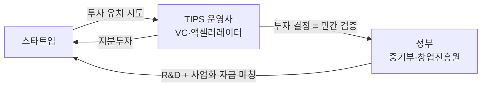
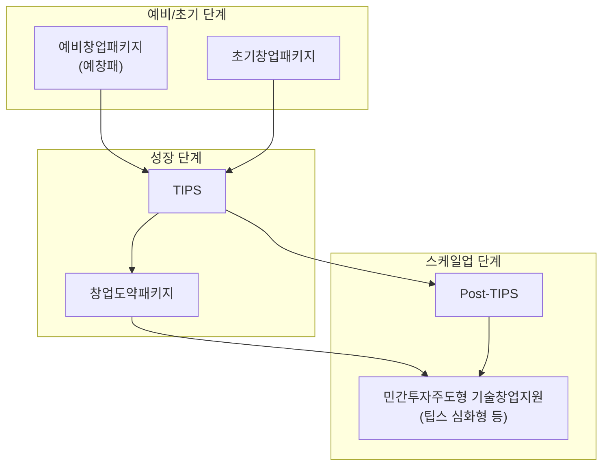
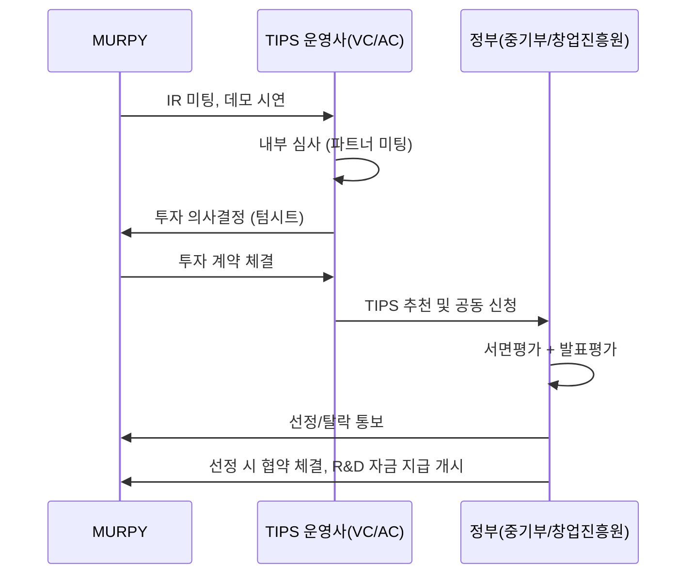
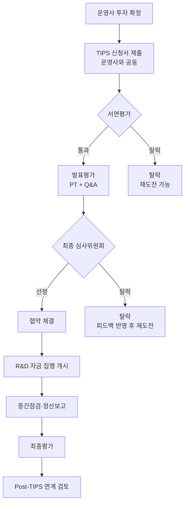
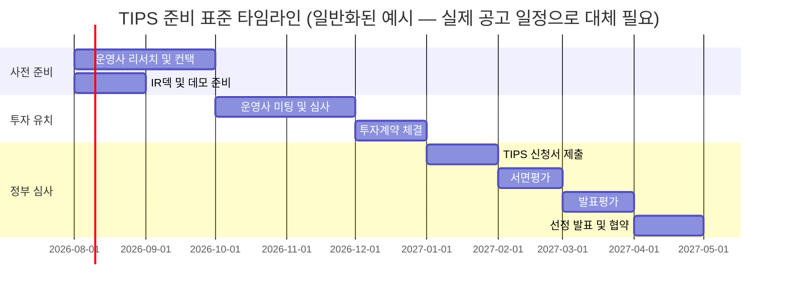

# 01. TIPS MASTER — 팁스(TIPS) 완전 가이드

> **문서 상태:** v1.0 (2026-07-21)
> **다음 갱신 시점:** TIPS 최신 공고 확인 후, 또는 실제 운영사 접촉 시작 시
> **중요 원칙:** 이 문서의 프로그램 구조·평가 로직·프로세스 설명은 TIPS 제도의 반복되는 뼈대를 다룬다. **금액·비율·일정처럼 매년 바뀌는 숫자는 반드시 중소벤처기업부·창업진흥원의 해당 연도 공식 공고문으로 재확인**해야 한다. 이 문서에서 그런 수치는 전부 "검증 필요"로 표기했다 — 확정된 사실처럼 투자자·운영사 앞에서 말하면 안 된다.

---

## Executive Summary

TIPS(Tech Incubator Program for Startup, 팁스)는 한국 정부(중소벤처기업부, 운영기관 창업진흥원)가 운영하는 민간주도형 기술창업지원 프로그램이다. 핵심 메커니즘은 단순하다 — **정부가 스타트업을 직접 심사하지 않는다. 정부가 신뢰하는 민간 투자사(TIPS 운영사)가 먼저 스타트업에 투자하면, 정부가 그 투자를 신뢰 신호로 받아들여 R&D 자금과 사업화 자금을 매칭 지원한다.**

이 구조 때문에 TIPS는 두 개의 관문으로 이루어진다.

1. **1관문 — 운영사 투자 유치.** TIPS로 지정된 액셀러레이터/VC 중 한 곳에서 실제 투자(엔젤 또는 VC 형태)를 받아야 한다. 이것이 TIPS 지원의 진짜 시작점이다.
2. **2관문 — 정부 심사(발표평가).** 운영사 투자가 확정된 상태로 중소벤처기업부/창업진흥원에 지원하면, 서면·발표 평가를 거쳐 선정 여부가 결정된다.

MURPY 입장에서 TIPS의 의미는 세 가지다.

- **비희석 자금(non-dilutive)에 가까운 실질 자금 조달.** 운영사 투자는 지분 희석이 있지만, 정부 매칭분은 상환 의무가 없는 R&D/사업화 지원금이다.
- **신뢰 시그널.** "TIPS 선정 기업"이라는 타이틀 자체가 후속 투자 유치, 채용, B2B 파트너십(센터·브랜드 협업)에서 신뢰도를 높인다.
- **강제된 규율.** 선정 이후 R&D 계획·마일스톤·정산 보고 의무가 생기므로, 대표 혼자 개발하던 방식에서 "관리되는 조직"으로 전환하는 압박이 된다.

이 문서는 TIPS 제도 자체의 완전한 이해, 그리고 **MURPY가 오늘부터 실제 지원까지 무엇을 준비해야 하는지**를 다룬다.

---

## 목차

1. TIPS란 무엇인가
2. 정부 창업생태계 안에서 TIPS의 위치
3. TIPS 운영사 매칭 — 진짜 첫 관문
4. 평가 프로세스 전체 흐름
5. 선정 기준 상세
6. 기술성 평가
7. 사업화 평가
8. 팀 평가
9. 필요 투자 조건
10. 필요 서류
11. 타임라인
12. 심사 프로세스 상세
13. 선정 이후 — 보고·정산 프로세스
14. 성공 사례 패턴
15. 실패 사례와 탈락 사유
16. 흔한 실수 체크리스트
17. MURPY 월별 준비 로드맵
18. 지원 체크리스트
19. FAQ
20. 부록 — 용어집, 참고 링크
21. 향후 확장

---

## 1. TIPS란 무엇인가

TIPS(Tech Incubator Program for Startup)는 2013년부터 시행된 한국의 대표적인 민간주도형 기술창업 지원 프로그램이다. "정부가 직접 옥석을 가리지 않고, 민간(투자 전문가)의 선구안을 정부 자금과 연결한다"는 철학이 핵심이다.

### 1.1 왜 이 구조가 존재하는가

정부 담당 공무원이나 심사위원이 모든 기술 스타트업의 사업성을 직접 판단하는 것은 구조적으로 어렵다. 반면 VC·액셀러레이터는 자기 돈을 걸고 투자하기 때문에 훨씬 날카로운 판단을 한다. TIPS는 이 판단력을 정부 자금 배분의 필터로 활용한다.

### 1.2 지원 자금의 구성 (일반적 구조 — 금액은 검증 필요)

TIPS는 통상 다음 항목으로 구성된다. **정확한 금액과 비율은 매년 공고마다 다르므로 반드시 해당 연도 공고문 확인.**

| 항목 | 내용 | 비고 |
|---|---|---|
| R&D 자금 | 기술 개발에 사용하는 정부 지원금 | 금액 검증 필요 |
| 창업사업화 자금 | 마케팅·인건비 등 사업화에 사용 | 금액 검증 필요, R&D와 별도 트랙일 수 있음 |
| 해외마케팅 자금 | 해외 진출 지원 (선택적 트랙) | MURPY는 초기엔 해당 없을 가능성 높음 |
| 운영사 투자 | 민간 투자사의 지분투자 | 금액은 운영사와 협상 |

**중요:** R&D 자금은 대부분 정부:기업 매칭 비율이 있고(예: 정부 75~80% + 기업 부담 20~25% 식), 기업 부담분 중 일부는 현금, 일부는 현물(대표 인건비 등)로 인정되는 경우가 많다. 이 비율도 검증 필요 — 실제로는 **"내 돈이 얼마나 들어가야 하는가"**를 가장 먼저 확인해야 한다.

### 1.3 TIPS의 대상

- 창업 후 일정 연차 이내(통상 7년 이내, 검증 필요)의 기술 기반 스타트업
- 특정 업종 제한이 있을 수 있음 (검증 필요 — MURPY처럼 소비자 플랫폼 + AI 자산 파이프라인 조합이 "기술창업"으로 인정되는지는 운영사 상담에서 확인해야 할 핵심 질문)
- 대표자의 병역·연령 등 자격 요건이 있을 수 있음 (검증 필요)

> **MURPY 체크포인트:** MURPY는 겉보기엔 "운동 커뮤니티 앱"이라 기술 스타트업으로 안 보일 위험이 있다. 지원 시 강조해야 할 기술 요소는 (1) 머피에셋스튜디오의 AI 기반 자산 자동 생산 파이프라인, (2) 실시간 위치 동기화(RTDB 기반 워킹 룸), (3) 운동 인증·위치·행동 데이터를 가상 자산·커뮤니티와 동기화하는 통합 플랫폼 구조(특허 검토 중, [[04_PATENT_MASTER]] 참고)다. 단순 "커뮤니티 앱"이 아니라 "AI 기반 자산 생성 인프라 + 행동 데이터 동기화 플랫폼"으로 포지셔닝해야 기술성 평가에서 유리하다.

---

## 2. 정부 창업생태계 안에서 TIPS의 위치

TIPS만 있는 게 아니다. 한국 정부의 창업 지원은 단계별로 계층화되어 있다. MURPY가 지금 어느 단계에 있는지, TIPS 전후로 어떤 프로그램이 있는지 알아야 순서를 잘못 잡지 않는다.

- **예비창업패키지(예창패):** 사업자등록 전 단계 대상. [[project_murpy_business]] 메모리에 따르면 대표는 "개인 개발자 계정 출시 → 예창패(사업자 미리 X, 체납 정리) → 법인 → 앱 이전" 순서를 검토 중 — 이는 정확히 TIPS 이전 단계로서 예창패를 먼저 노리는 합리적인 순서다.
- **초기창업패키지:** 사업자등록 후 3년 이내 대상, 예창패보다 지원 규모가 큰 경우가 많음.
- **TIPS:** 기술 기반, 민간 투자 매칭이 핵심 조건. 예창패/초기창업패키지보다 지원 규모가 크고 신뢰도가 높다.
- **Post-TIPS / 창업도약패키지:** TIPS 이후 스케일업 단계 지원. MURPY의 장기 로드맵상 Series A 전후 시점과 맞물릴 가능성.

> **MURPY 체크포인트:** 현재 대표는 사업자 미등록 상태([[project_murpy_business]]). TIPS는 원칙적으로 사업자(법인 또는 개인사업자) 상태를 전제로 하는 경우가 많으므로, **예창패 → 사업자/법인 전환 → TIPS** 순서가 타당하다. TIPS를 사업자등록 없이 지원할 수 있는지는 반드시 운영사 상담 초기에 확인해야 할 질문이다.

---

## 3. TIPS 운영사 매칭 — 진짜 첫 관문

가장 많은 창업자가 오해하는 지점: **TIPS는 정부에 먼저 지원하는 프로그램이 아니다.** 순서가 반대다.

즉 **TIPS 준비의 80%는 "좋은 운영사를 찾아 투자를 받는 것"이고, 나머지 20%가 정부 서류·발표**다. [[02_VC_MASTER]]에서 다루는 투자 유치 전략이 TIPS 준비의 전제조건이라는 뜻이다.

### 3.1 운영사를 고르는 기준

운영사마다 투자 포커스(소비자 플랫폼, B2B SaaS, 딥테크, 헬스케어 등)와 트랙레코드가 다르다. MURPY처럼 "피트니스 + 소셜 + AI 자산 파이프라인" 조합은 다음 카테고리 운영사와 결이 맞을 가능성이 높다 — 단, **실제 리스트와 포커스는 외부 리서치 필요**([[07_OPERATING_PARTNERS]] 참고).

- 소비자(컨슈머) 서비스/플랫폼 전문 운영사
- 헬스·피트니스·웰니스 버티컬 투자 이력이 있는 운영사
- 게임·캐릭터·디지털 자산(아바타 경제) 투자 이력이 있는 운영사
- 로컬/오프라인 연계형(O2O) 플랫폼 투자 이력이 있는 운영사

### 3.2 운영사 접촉 전 준비물

- 데모 가능한 제품 (MURPY는 이미 실사용 가능한 단일 HTML 앱 + Firebase 실연동 — 상당한 강점)
- 팀 소개 및 Founder-Market Fit 스토리 ([[03_IR_MASTER]]와 연동)
- 초기 트랙션 (GBD CREW 247명 등 실제 커뮤니티 운영 경험 — [[project_murpy_business]], [[project_murpy_roadmap]])
- 최소 버전의 재무 시나리오 (`MURPY_사업_설명서_최종본.md` 27장 참고)

---

## 4. 평가 프로세스 전체 흐름

전체 과정은 통상 운영사 접촉 시작부터 협약 체결까지 **수개월 단위**로 소요된다(정확한 기간은 검증 필요, 연도·경쟁률에 따라 변동). MURPY의 준비 로드맵(17장)은 이 소요 기간을 역산해서 짠다.

---

## 5. 선정 기준 상세

TIPS 심사는 통상 세 축으로 구성된다 — **기술성, 사업화 가능성, 팀 역량**. 각 축의 세부 항목은 다음과 같다 (일반적 프레임워크이며, 실제 평가표는 연도별 공고문 별첨 확인 필요).

| 평가축 | 핵심 질문 | MURPY 대응 챕터 |
|---|---|---|
| 기술성 | 이 팀만이 만들 수 있는 기술적 진입장벽이 있는가? | 6장 |
| 사업화 가능성 | 시장이 크고, 이 팀이 매출을 만들 구체적 경로가 있는가? | 7장 |
| 팀 역량 | 이 팀이 이 문제를 풀 자격이 있는가? | 8장 |

세 축은 독립적이지 않다. 심사위원은 "기술은 좋은데 팀이 약하다" 혹은 "팀은 좋은데 시장이 작다" 같은 조합을 가장 경계한다. MURPY는 세 축을 하나의 스토리로 묶어야 한다 — **"247명 커뮤니티를 직접 운영한 창업자가, 그 운영에서 겪은 실제 문제를, AI 기반 자산 파이프라인이라는 기술로 풀고 있다."**

---

## 6. 기술성 평가

### 6.1 심사위원이 실제로 보는 것

- 이 기술이 **재현 불가능**한가, 아니면 외주로 3개월이면 카피 가능한가
- 기술이 **핵심 사업 문제**를 푸는가, 아니면 장식적인가
- 기술 로드맵이 **구체적**인가 (모호한 "AI 접목" 수준이 아니라)

### 6.2 MURPY의 기술성 스토리

`MURPY_사업_설명서_최종본.md` 21장(해자)의 내용을 TIPS 언어로 재구성하면:

1. **머피에셋스튜디오 파이프라인** — AI 착용 이미지 생성 → 기준 바디 차이 추출 → 슬롯 영역 제한 → 자동 후처리 → 검증 → 사람 보정 → 승인 큐. 이는 "AI를 썼다"가 아니라 **AI 생성물의 구조적 결함(halo, 경계 오염, 비율 불일치)을 자동 검출·보정하는 독자적 파이프라인**이라는 점이 기술성의 핵심이다. [[project_murpy_asset_studio]] 메모리에 실측된 병목 원인 3가지가 이 기술의 구체성을 뒷받침한다.
2. **실시간 위치 동기화 시스템** — Firestore(영속 데이터) + Firebase RTDB(휘발성 위치) 이원화 구조로 다수 캐릭터의 실시간 이동·presence·입퇴장을 동기화. 이는 일반적인 CRUD 앱과 다른 실시간 시스템 설계 역량을 보여준다.
3. **통합 플랫폼 특허 방향성** — 운동 데이터·위치정보를 가상 자산·커뮤니티·센터 도감과 동기화하는 구조. [[04_PATENT_MASTER]] 참고.

### 6.3 기술성 평가에서 주의할 함정

- **"단일 HTML 파일"이라는 사실을 숨기지 말 것.** 오히려 "복잡한 인프라 없이 1만 줄 규모의 단일 아키텍처로 6개 탭·실시간 매칭·캐릭터 렌더링·Firebase 실연동까지 구현한 실행 속도"로 프레이밍하면 강점이 된다. 다만 스케일업 로드맵(마이크로서비스 전환, Cloud Functions 이관 등)을 함께 제시해야 "확장 불가능한 기술"로 오해받지 않는다.
- **AI 의존을 기술로 착각하지 말 것.** "이미지 생성 API를 썼다"는 기술성이 아니다. "생성물의 결함을 자동 검출·보정하는 파이프라인을 만들었다"가 기술성이다.

---

## 7. 사업화 평가

### 7.1 심사위원이 실제로 보는 것

- TAM/SAM/SOM이 합리적으로 산정되었는가 (허수 시장 규모 아닌가)
- 수익모델이 구체적이고 검증 가능한가
- Go-to-Market이 막연한 "바이럴로 성장"이 아니라 구체적 채널을 갖는가

### 7.2 MURPY의 사업화 스토리

`MURPY_사업_설명서_최종본.md` 19~24장을 그대로 활용 가능 — TAM/SAM/SOM(19.3), 수익모델(11장, 23장), GTM(24장)이 이미 상당히 정교하게 작성되어 있다. TIPS 서류에서는 이를 **정부 심사 언어**로 압축해야 한다 — 정부 심사는 스토리텔링보다 **표·숫자·단계별 마일스톤**을 선호하는 경향이 있다.

### 7.3 사업화 평가에서 주의할 함정

- 시장 규모를 84조 원(국내 스포츠산업 전체)으로 제시하면서 실제 사업모델과의 연결고리를 설명하지 않으면 "허수 TAM"으로 감점된다. 반드시 SAM/SOM 산출 근거(19.3장)를 같이 제시.
- 수익모델이 6가지(PRO, 디지털 아이템, 프리미엄 센터, 브랜드 협업, 크루 경제, 이벤트)로 나열되어 있는데, TIPS 심사에서는 **"초기 12개월 안에 실제로 검증할 1~2개"**를 명확히 짚어야 한다. 전부 동시에 하겠다는 계획은 오히려 산만함으로 감점 요인.

---

## 8. 팀 평가

### 8.1 심사위원이 실제로 보는 것

- Founder-Market Fit — 이 창업자가 이 문제를 풀 이유가 있는가
- 팀 구성의 공백 — 개발·영업·운영 중 비어있는 역할이 방치되고 있는가
- 실행력의 증거 — 아이디어 단계인가, 실제로 무언가를 만들고 운영해본 경험이 있는가

### 8.2 MURPY의 팀 스토리

`MURPY_사업_설명서_최종본.md` 26장(Founder-Market Fit)이 이미 강력한 자료다: 퍼스널 트레이너 경력, 247명 GBD CREW 직접 운영, 제품을 직접 설계·개발. **"시장을 관찰해서 만든 게 아니라 직접 겪은 문제를 풀고 있다"**는 서사는 TIPS 심사에서 가장 설득력 있는 팀 평가 요소 중 하나다.

### 8.3 팀 평가에서 주의할 함정 — MURPY의 가장 큰 약점

- **1인 개발 체제.** 대표 혼자 개발·기획·운영을 전부 담당하는 구조는 심사에서 "대표 의존 리스크"(`MURPY_사업_설명서_최종본.md` 29장)로 지적받을 가능성이 매우 높다.
- **대응 전략:** (1) TIPS 선정 자체를 채용 자금 확보 수단으로 프레이밍 — "선정되면 개발자·운영·B2B 영업 인력을 채용해 팀을 완성한다"는 구체적 채용 계획(26.3장)을 서류에 명시. (2) AI 도구(Claude Code 등)를 활용한 개발 생산성을 팀 약점을 상쇄하는 근거로 일부 활용 가능하나, 과도하게 강조하면 "대표가 없으면 무너지는 회사"로 보일 위험도 있으므로 균형이 필요.

---

## 9. 필요 투자 조건

- 운영사로부터 받아야 하는 **최소 투자금액**이 존재 (검증 필요 — 연도·트랙별 상이)
- 투자 형태: 지분투자(보통주/우선주) 또는 조건부지분인수계약(SAFE 유사 구조), 컨버터블 노트 등 — 운영사와 협상 ([[02_VC_MASTER]] 참고)
- 정부 매칭 자금 대비 **기업 부담분(대응자금)** 존재 — 현금·현물 비율 검증 필요
- 대표자 지분율 요건 (과도한 지분 희석 시 자격 제한이 있을 수 있음, 검증 필요)

> **MURPY 체크포인트:** 사업자 미등록 상태에서는 지분투자 계약 자체가 불가능하다. 법인 설립 시점과 투자 유치 시점의 순서를 [[project_murpy_business]]의 사업자 전환 로드맵과 맞춰야 한다.

---

## 10. 필요 서류

일반적으로 요구되는 서류 카테고리 (연도별 공고문에서 정확한 양식 확인 필수):

- [ ] 사업계획서 (정부 지정 양식 — `MURPY_사업_설명서_최종본.md`를 양식에 맞춰 재구성)
- [ ] 사업자등록증 또는 법인등기부등본
- [ ] 대표자 이력서/경력증명
- [ ] 팀원 이력서
- [ ] 투자계약서(운영사와 체결한) 또는 투자확약서
- [ ] 기술 관련 증빙 (특허 출원 서류가 있다면 가점 요소 — [[04_PATENT_MASTER]])
- [ ] 재무제표 (초기 기업은 간이 형태)
- [ ] 지적재산권 현황 (상표·저작권 등록 여부)
- [ ] 최근 매출·투자 유치 이력 증빙 (있는 경우)

---

## 11. 타임라인

**주의:** 이 간트차트는 준비 단계의 논리적 순서를 보여주기 위한 일반화 모델이다. 실제 TIPS는 연 1~수회 정기 공고를 내며 공고별로 접수 기간이 정해져 있으므로, **반드시 해당 연도 공고 캘린더를 확인해 이 타임라인을 실제 날짜로 교체**해야 한다.

---

## 12. 심사 프로세스 상세

### 12.1 서면평가

제출 서류만으로 1차 필터링. 이 단계의 핵심은 **명료함**이다 — 심사위원 한 명이 수십 개 서류를 짧은 시간에 훑는다는 전제하에, 첫 페이지에서 "무엇을 하는 회사인지"가 즉시 이해되어야 한다.

### 12.2 발표평가(PT)

통상 발표 시간 + Q&A로 구성 (시간 배분은 검증 필요). 이 단계의 핵심 리스크는 다음과 같다.

- 발표 시간을 지키지 못해 핵심 내용을 다 못 보여줌 → [[03_IR_MASTER]]의 시간대별 피치 구조(3분/5분/10분/20분) 훈련 필요
- Q&A에서 준비 안 된 질문에 흔들림 → [[08_INVESTOR_FAQ]]로 사전 대응

### 12.3 심사위원 구성

통상 학계·업계 전문가, VC 심사역 등으로 구성되는 심사위원단. MURPY처럼 소비자 플랫폼 + 게임적 요소를 가진 아이템은 "이게 진짜 기술 스타트업이 맞느냐"는 회의적 질문을 받을 가능성이 있다 — 6장의 기술성 스토리를 방어 논리로 준비해야 한다.

---

## 13. 선정 이후 — 보고·정산 프로세스

TIPS는 선정으로 끝나지 않는다. 협약 이후의 의무를 과소평가하면 정산 단계에서 문제가 생긴다.

- **중간점검:** 사업 진행 상황·자금 집행 내역 보고
- **정산보고:** R&D 자금 사용 증빙 (세금계산서, 인건비 지급 내역 등) — 사업 목적 외 사용 시 환수 조치 가능
- **최종평가:** 계획 대비 실적 평가, Post-TIPS 연계 여부에 영향

> **MURPY 체크포인트:** 대표 혼자 운영하는 현재 구조에서는 회계·정산 업무를 담당할 인력이 없다. TIPS 선정 시 **세무/회계 아웃소싱 또는 겸직 인력 확보를 초기 자금 집행 계획에 반드시 포함**해야 한다. 이는 [[07_OPERATING_PARTNERS]]와 [[legal/]] 폴더에서 실행 준비.

---

## 14. 성공 사례 패턴 (일반화)

구체적 기업명·수치는 외부 공개 사례 조사가 필요하다(이 문서에서 임의로 지어내지 않는다). 다만 반복적으로 관찰되는 **성공 패턴**은 다음과 같이 정리할 수 있다.

1. **창업자가 문제를 직접 겪은 도메인 전문가였다** (MURPY와 정확히 일치하는 패턴)
2. **투자 유치 전에 이미 작동하는 제품/커뮤니티가 있었다** (MURPY의 GBD CREW·실사용 앱과 일치)
3. **기술 스토리가 구체적이고 반복 가능한 파이프라인 형태였다** (MURPY의 머피에셋스튜디오와 일치 방향)
4. **팀 확장 계획이 자금 사용 계획과 정확히 연결되어 있었다**

---

## 15. 실패 사례와 탈락 사유 (일반화)

일반적으로 관찰되는 탈락 패턴 (외부 사례 조사로 구체화 필요, [[09_FAILURE_CASES]]와 교차 참조):

| 탈락 사유 | MURPY 리스크 수준 | 대응 |
|---|---|---|
| 기술성 부족 ("그냥 앱") | 중간 — 프레이밍 실패 시 위험 | 6장의 기술 스토리 강화 |
| 팀 역량 부족 (1인 체제) | 높음 | 8.3장 대응 전략 |
| 시장 규모 과장/근거 부족 | 낮음 — 이미 정부 통계 인용 확보 | 7.3장 유지 |
| 수익모델 불명확/산만함 | 중간 — 수익모델이 6개로 많음 | 초기 12개월 집중 모델 압축 |
| 운영사 매칭 실패(애초에 투자를 못 받음) | 미지 — 아직 시도 전 | 3장, [[02_VC_MASTER]] |
| 서류 완성도 부족 | 낮음(대응 가능) | 10장 체크리스트 준수 |

---

## 16. 흔한 실수 체크리스트

- [ ] 정부 지원금을 "공짜 돈"으로 여기고 사업화 실행력 없이 지원 (탈락 확률 높음)
- [ ] 운영사 없이 정부에 먼저 지원하려는 시도 (구조 자체를 오해)
- [ ] 발표 시간 초과로 핵심 내용을 다 못 보여줌
- [ ] Q&A에서 숫자 근거를 즉답 못 함 (TAM 출처, 수익모델 가정 등)
- [ ] 팀 약점(1인 체제)을 숨기려다 오히려 신뢰도 하락 — 약점을 인정하고 구체적 보완 계획을 보여주는 것이 더 설득력 있음
- [ ] 사업계획서와 실제 제품 데모가 불일치 (과장된 로드맵을 이미 완성한 것처럼 서술)

---

## 17. MURPY 월별 준비 로드맵

> 이 로드맵은 실제 TIPS 공고 일정이 확정되는 즉시 날짜를 교체해야 하는 **템플릿**이다. [[06_EXECUTION_ROADMAP]]의 전사 로드맵과 동기화 필요.

### Month 1 — 기반 정리
- 사업자/법인 전환 로드맵 확정 ([[project_murpy_business]] 연계)
- TIPS 운영사 후보 리스트 조사 시작 ([[07_OPERATING_PARTNERS]])
- IR 초안 작성 ([[03_IR_MASTER]] 착수)

### Month 2 — 자료 완성
- 데모 시나리오 정리 (실제 앱 시연 흐름 스크립트화)
- GBD CREW 트랙션 데이터 정량화 (가입률, 활동 지표 — [[05_KPI_MASTER]] 연계)
- 팀 확장 계획(채용 로드맵) 문서화

### Month 3 — 운영사 컨택
- 후보 운영사 5~10곳 콜드 컨택/웜 인트로 시도
- 미팅 피드백을 IR 자료에 즉시 반영 (반복 개선)

### Month 4~5 — 투자 협상 및 체결
- 텀시트 검토 ([[02_VC_MASTER]] 참고)
- 투자 계약 체결

### Month 6 — TIPS 신청
- 정부 지정 양식으로 사업계획서 재구성
- 서면평가 대응

### Month 7 — 발표평가
- PT 리허설 (3분/5분/10분/20분 버전 전부 준비 — [[03_IR_MASTER]])
- 예상 질문 100개+ 답변 숙지 ([[08_INVESTOR_FAQ]])

### Month 8~ — 결과 및 후속
- 선정 시: 협약, 자금 집행 계획 실행, 정산 체계 구축
- 탈락 시: 피드백 반영, 다음 공고 재도전 준비

---

## 18. 지원 체크리스트

### 자격 요건
- [ ] 대표자/기업 연차 요건 충족 확인
- [ ] 사업자등록/법인 상태 요건 충족
- [ ] 업종 분류상 기술창업 인정 가능성 확인 (운영사 상담으로 사전 검증)

### 투자
- [ ] TIPS 운영사로부터 투자 확약 확보
- [ ] 투자 계약서 검토 완료 (지분율, 밸류에이션, 이사회 구성 등)

### 서류
- [ ] 사업계획서 정부 양식 작성 완료
- [ ] 팀 이력서 전원 취합
- [ ] 재무 자료 준비
- [ ] IP 현황 정리 (상표·특허 출원 여부)

### 발표
- [ ] 시간대별 피치 자료 준비 (3/5/10/20분)
- [ ] 예상 질문 답변 리허설
- [ ] 데모 환경 사전 점검 (네트워크 이슈 등 기술적 리스크 제거)

---

## 19. FAQ

**Q1. 사업자등록 없이 TIPS에 지원할 수 있나?**
검증 필요. 통상 사업자 상태를 전제하는 경우가 많다. 운영사 상담 시 최우선으로 확인할 질문.

**Q2. 매출이 전혀 없어도 지원 가능한가?**
가능성 있음 — TIPS는 초기 기술 스타트업을 대상으로 하므로 매출보다 기술성·팀·시장성을 본다. 다만 최근 트렌드는 "이미 검증된 트랙션"을 선호하는 경향도 있어 검증 필요.

**Q3. 1인 창업 상태로 지원 가능한가?**
가능은 하나 팀 평가에서 불리할 수 있다(8.3장). 공동창업자나 핵심 인력 합류가 심사에 유리하다는 것이 일반적 관측 — 검증 필요.

**Q4. 여러 운영사에 동시에 컨택해도 되나?**
일반적으로 가능하며 오히려 권장된다(경쟁을 통해 유리한 조건 확보). 다만 운영사 업계는 좁아서 평판 관리 필요.

**Q5. TIPS 탈락하면 재지원 가능한가?**
가능. 탈락 사유를 파악하고 보완해서 다음 공고에 재도전하는 것이 일반적 패턴.

**Q6. TIPS 선정 후 지분은 얼마나 희석되나?**
운영사 투자 비율에 따라 다르다. [[02_VC_MASTER]]의 밸류에이션·캡테이블 장 참고.

**Q7. MURPY처럼 게임적 요소(캐릭터, 아이템)가 있는 서비스도 "기술창업"으로 인정되나?**
불확실 — 이것이 MURPY에게 가장 중요한 리스크 질문 중 하나다. 6.3장의 기술 프레이밍이 이 우려를 상쇄하는 핵심 전략이다. 운영사 상담 초기에 반드시 직접 물어봐야 한다.

---

## 20. 부록

### 20.1 용어집

| 용어 | 의미 |
|---|---|
| TIPS | Tech Incubator Program for Startup |
| 운영사 | TIPS 프로그램 참여 자격을 가진 민간 투자사(VC/액셀러레이터) |
| 매칭자금 | 민간 투자에 대응해 정부가 지원하는 R&D·사업화 자금 |
| 대응자금 | 정부 매칭에 대해 기업이 부담해야 하는 자기부담분 |
| Post-TIPS | TIPS 이후 스케일업 단계 연계 지원 프로그램 |
| 서면평가 | 제출 서류만으로 진행하는 1차 심사 |
| 발표평가 | PT + Q&A 형식의 대면(또는 화상) 심사 |

### 20.2 참고 자료 (확인 및 정리 필요 — `references/` 폴더로 이관 예정)

- 중소벤처기업부 공식 공고 채널
- 창업진흥원(K-Startup) 공식 사이트
- TIPS 운영사 공식 리스트

### 20.3 관련 문서

- [[MURPY_사업_설명서_최종본]] — 제품·시장·수익모델 원본
- [[02_VC_MASTER]] — 투자 유치 전반
- [[03_IR_MASTER]] — 발표·피치 전략
- [[04_PATENT_MASTER]] — 기술성 뒷받침 IP 전략
- [[07_OPERATING_PARTNERS]] — 운영사별 상세 대응
- [[08_INVESTOR_FAQ]] — 예상 질문 확장판
- [[project_murpy_business]] (Claude 메모리) — 사업자 전환 진행 상황

---

## 21. 향후 확장

- [ ] 실제 TIPS 공고문 확보 후 3장(운영사 매칭)·11장(타임라인)·17장(로드맵)을 실제 날짜·금액으로 갱신
- [ ] 운영사 리서치 완료 후 [[07_OPERATING_PARTNERS]] 작성, 이 문서 3.1장과 상호 링크
- [ ] 정부 지정 사업계획서 양식 확보 시 10장에 실제 목차 반영
- [ ] TIPS 선정 사례 3~5개 실제 조사 후 14장 구체화
- [ ] 탈락 사례/피드백 실제 확보 시 15장 구체화
- [ ] 첫 운영사 미팅 후 `tips/` 폴더에 미팅 노트 축적 시작

---

이전: [[MASTER_INDEX]] · 다음: [[02_VC_MASTER]]
