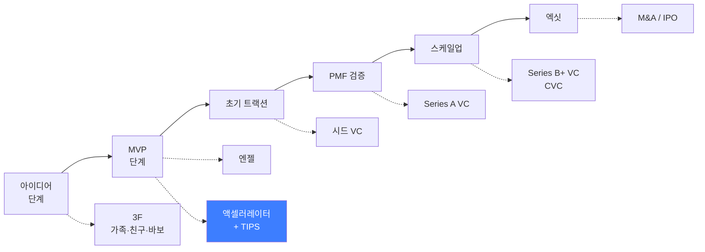
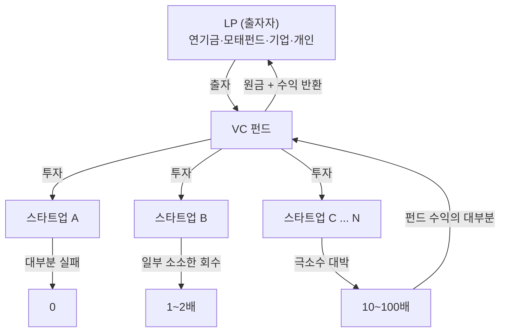
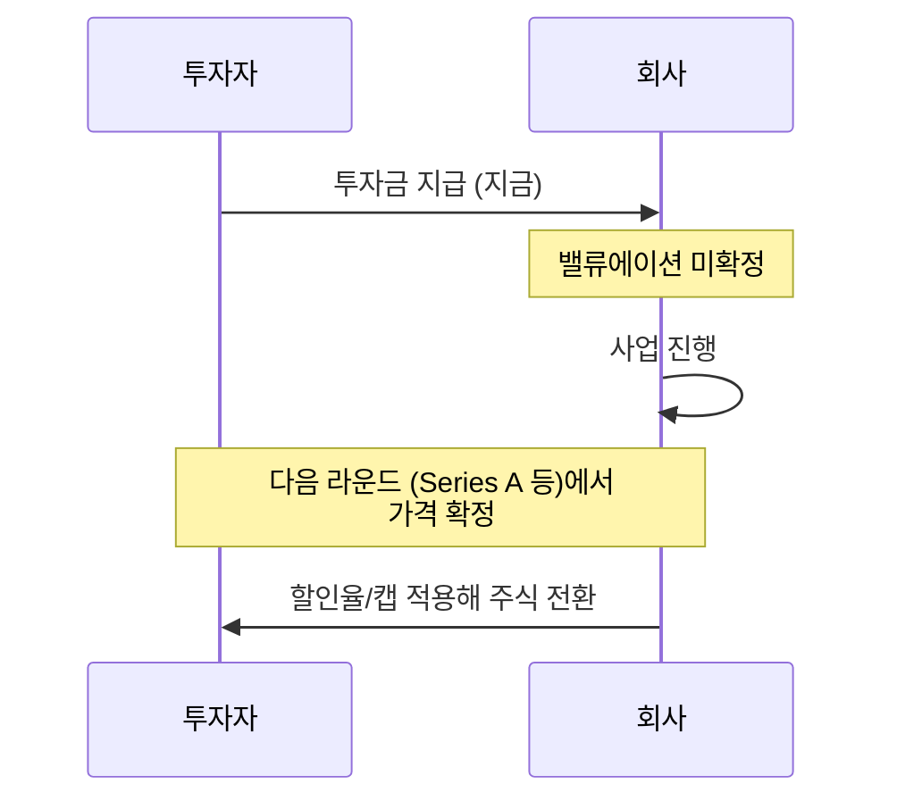
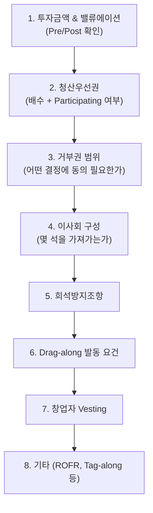
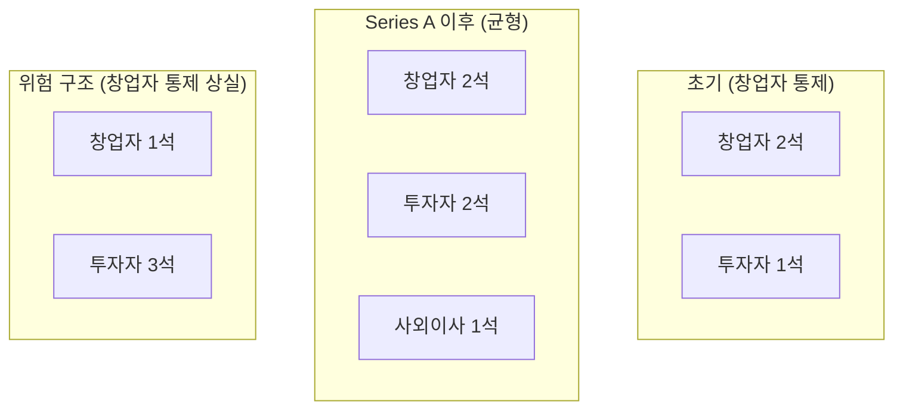
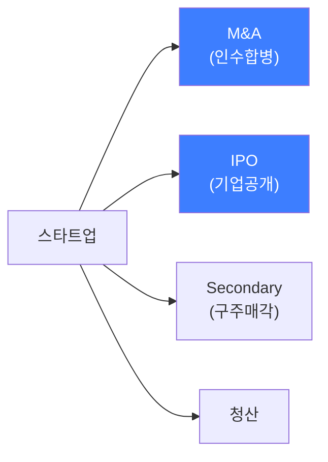
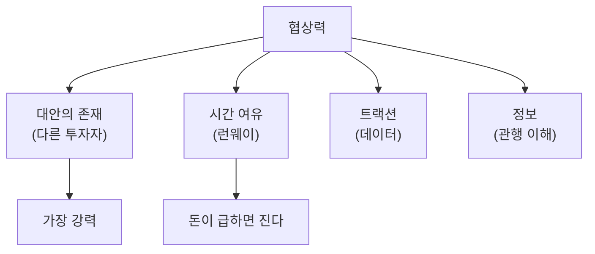
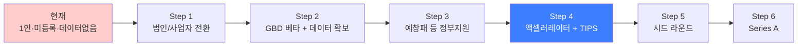

# 02. VC MASTER — 투자 유치 완전 가이드

> **문서 상태:** v1.0 (2026-07-21)
> **원칙:** 투자 계약 구조와 협상 로직은 시장 관행으로 안정적이지만, **구체적 밸류에이션 수준·시장 조건·법률 해석은 시점과 딜마다 다르다.** 이 문서는 의사결정 프레임워크를 제공하며, 실제 계약 체결 전에는 반드시 변호사·회계사 검토를 거쳐야 한다. 법률 자문을 대체하지 않는다.

---

## Executive Summary

투자 유치는 "돈을 구하는 일"이 아니라 **회사의 지분과 통제권을 판매하는 거래**다. 이 관점 전환이 이 문서 전체의 출발점이다.

창업자가 투자 유치에서 실패하는 방식은 두 가지다.

1. **돈을 못 구한다** — 표면적 실패. 아프지만 회복 가능하다.
2. **나쁜 조건으로 돈을 구한다** — 잠재적 실패. 당장은 성공처럼 보이지만 다음 라운드, 혹은 엑싯 시점에 창업자가 아무것도 못 가져가는 구조가 된다.

MURPY는 현재 **투자 유치 이전 단계**다. 사업자 미등록, 1인 체제, 매출 없음, 코호트 데이터 없음. 이 상태에서 이 문서의 실용적 가치는 "지금 당장 VC를 만나라"가 아니라 **"어떤 상태가 되어야 만날 가치가 있고, 만났을 때 무엇을 조심해야 하는가"**를 미리 아는 데 있다.

핵심 결론 3가지:

- **MURPY의 현실적 첫 관문은 VC가 아니라 [[01_TIPS_MASTER]]의 TIPS 운영사(액셀러레이터)다.** 일반 VC는 통상 더 뒤 단계에서 들어온다.
- **투자 유치의 성패는 미팅 실력이 아니라 미팅 전 상태(트랙션)에서 이미 80% 결정된다.** [[05_KPI_MASTER]]가 이 문서보다 먼저 실행되어야 하는 이유다.
- **첫 라운드의 조건이 이후 모든 라운드를 구속한다.** 급하다는 이유로 첫 계약을 대충 하면 되돌릴 수 없다.

---

## 목차

1. 투자자 유형 지도
2. 엔젤 투자자
3. 액셀러레이터
4. VC (벤처캐피털)
5. CVC (기업형 VC)
6. 투자 계약 수단 — SAFE
7. 투자 계약 수단 — 전환사채(CN)
8. 투자 계약 수단 — 우선주
9. 텀시트 완전 해부
10. 캡테이블 관리
11. 실사(Due Diligence)
12. 이사회 구조와 지배구조
13. 라운드별 전략 — Seed
14. 라운드별 전략 — Pre-Series A
15. 라운드별 전략 — Series A
16. 라운드별 전략 — Series B 이후
17. 엑싯 전략
18. 밸류에이션 결정 원리
19. 협상 전략
20. MURPY의 투자 유치 로드맵
21. 체크리스트
22. 부록·향후 확장

---

## 1. 투자자 유형 지도

MURPY의 현재 위치는 **B(MVP 단계)에서 C(초기 트랙션)로 넘어가는 구간**이다. 실사용 가능한 앱이 있고 GBD CREW라는 실제 커뮤니티가 있지만, 코호트 데이터로 검증된 리텐션 지표는 아직 없다.

이 위치에서 현실적으로 접근 가능한 투자자는 **액셀러레이터(TIPS 운영사)와 엔젤**이다. 일반 시드 VC는 통상 최소한의 지표를 요구한다.

### 1.1 투자자 유형별 비교

| 유형 | 투자 규모 | 의사결정 속도 | 요구 지표 | 제공 가치 | MURPY 적합도 |
|---|---|---|---|---|---|
| 3F (가족·지인) | 소액 | 빠름 | 없음 | 자금만 | 관계 리스크 큼, 비권장 |
| 엔젤 | 소액~중간 | 빠름 (개인 판단) | 낮음 | 자금 + 개인 네트워크 | 높음 |
| 액셀러레이터 | 소액~중간 | 중간 (프로그램 주기) | 낮음~중간 | 자금 + 보육 + TIPS 연계 | **최우선** |
| 시드 VC | 중간 | 중간 | 중간 (초기 지표) | 자금 + 후속 라운드 연결 | 중간 |
| Series A VC | 큼 | 느림 (수개월) | 높음 (PMF 증명) | 자금 + 스케일업 지원 | 현 시점 부적합 |
| CVC | 큼 | 느림 | 높음 + 전략적 시너지 | 자금 + 사업 제휴 | 향후 (스포츠·패션 브랜드) |

---

## 2. 엔젤 투자자

### 2.1 정의와 특성

개인 자산으로 초기 스타트업에 투자하는 개인 투자자. 통상 성공한 창업자, 임원, 전문직이 많다.

**장점:**
- 의사결정이 빠르다 (본인 돈, 본인 판단)
- 서류 요구가 상대적으로 적다
- 도메인 전문 엔젤을 만나면 자금보다 조언·네트워크가 더 가치 있을 수 있다

**단점:**
- 금액이 작다
- 후속 라운드 지원 여력이 없다
- 개인 성향에 따라 과도하게 간섭할 수 있다
- 여러 명에게 소액씩 받으면 캡테이블이 지저분해진다 (10장 참고)

### 2.2 한국의 엔젤 관련 제도

- **개인투자조합**: 여러 엔젤이 조합을 결성해 투자하는 형태. 세제 혜택이 있다.
- **엔젤투자매칭펀드**: 정부(한국벤처투자 등)가 엔젤 투자에 매칭 투자하는 제도 — 세부 요건·비율은 검증 필요.
- **소득공제**: 엔젤 투자자에게 소득공제 혜택이 있어, 투자 유인이 된다. (구체적 공제율·한도는 세법 개정에 따라 변동, 검증 필요)

> **MURPY 활용 포인트:** 피트니스 업계 인맥(센터 원장, 프랜차이즈 대표, 유명 트레이너 등) 중 엔젤 투자 여력이 있는 인물은 **자금 + 센터 제휴 네트워크**를 동시에 제공할 수 있다. `MURPY_사업_설명서_최종본.md` 22.1장의 센터 B2B 전략과 직접 연결된다. 단순 재무적 엔젤보다 **전략적 엔젤**을 우선 탐색할 것.

### 2.3 엔젤 투자 시 주의사항

- **지분율을 과도하게 주지 말 것.** 초기에 20~30%를 소액에 넘기면 이후 라운드에서 창업자 지분이 급격히 희석된다.
- **후속 투자 참여 의무가 없다는 것을 전제하고 설계할 것.**
- **관계 리스크:** 지인 엔젤에게 투자받고 회사가 실패하면 관계까지 잃는다. 투자 전 실패 가능성을 명확히 고지하는 것이 오히려 관계를 보호한다.

---

## 3. 액셀러레이터

### 3.1 정의

초기 스타트업에 소액 투자 + 집중 보육 프로그램(멘토링, 네트워킹, 데모데이)을 제공하는 기관. 한국에서는 **창업기획자**로 등록된 법인이 이에 해당한다.

**MURPY에게 가장 중요한 투자자 유형**이다. 이유는 [[01_TIPS_MASTER]]에서 설명한 대로, TIPS 운영사 자격을 가진 액셀러레이터의 투자가 TIPS 지원의 전제조건이기 때문이다.

### 3.2 액셀러레이터가 제공하는 것

| 항목 | 내용 | MURPY에게 가치 |
|---|---|---|
| 자금 | 소액 투자 | 중간 |
| 프로그램 | 3~6개월 보육, 멘토링 | 높음 (1인 체제 보완) |
| 네트워크 | 후속 투자자 소개, 파트너 연결 | **매우 높음** |
| TIPS 연계 | TIPS 추천 및 공동 신청 | **최우선 가치** |
| 데모데이 | 다수 투자자 앞 발표 기회 | 높음 |
| 신뢰 시그널 | "OO 액셀러레이터 배출" 타이틀 | 중간 |

### 3.3 액셀러레이터 선택 기준

1. **TIPS 운영사 자격 보유 여부** — MURPY에게는 사실상 필수 조건
2. **포트폴리오 적합성** — 소비자 플랫폼/헬스케어/게임 투자 이력이 있는가
3. **후속 투자 연결 능력** — 배출 기업들이 실제로 다음 라운드를 받았는가
4. **프로그램의 실질** — 형식적 멘토링인가, 실제 도움이 되는가 (배출 기업 창업자에게 직접 물어보는 것이 가장 정확)
5. **지분 요구율** — 과도한 지분을 요구하는 곳은 피한다

> **실행 항목:** 실제 액셀러레이터 후보 리스트와 각각의 투자 포커스는 [[07_OPERATING_PARTNERS]]에서 다룬다. 외부 리서치가 필요하므로 이 문서에서는 임의로 기관명을 나열하지 않는다.

---

## 4. VC (벤처캐피털)

### 4.1 VC의 작동 원리 — 창업자가 반드시 이해해야 할 것

VC는 자선단체가 아니다. VC는 **LP(Limited Partner, 출자자)의 돈을 받아 운용하는 펀드**이며, 정해진 기간(통상 8~10년) 안에 수익을 내서 돌려줘야 하는 의무가 있다.

**이 구조가 만드는 결과:**

- VC는 "안정적으로 연 20% 성장하는 회사"에 관심이 없다. 펀드 구조상 **10배 이상 성장 가능성이 있는 회사**만 의미가 있다.
- 따라서 VC 미팅에서 "우리는 착실하게 흑자를 낼 겁니다"는 좋은 답이 아니다. **"이 시장에서 우리가 압도적 1위가 되면 얼마나 커지는가"**를 말해야 한다.
- VC가 투자를 거절하는 것은 "당신 사업이 나쁘다"가 아니라 "우리 펀드 구조에 안 맞는다"인 경우가 많다.

> **MURPY 시사점:** MURPY의 사업 구조(구독 + 디지털 아이템 + B2B 센터 + 브랜드 협업)는 착실한 수익 사업으로도 가능하다. 하지만 VC를 만나려면 **"피트니스 소셜 OS"**라는 큰 그림(`MURPY_사업_설명서_최종본.md` 18장, 31장)을 전면에 내세워야 한다. 이것이 과장이 아니라 실제 야망이어야 한다 — 아니라면 VC 대신 다른 자금 조달 경로(정부지원 + 자체 매출)를 선택하는 것이 정직하고 현명하다.

### 4.2 VC의 투자 판단 기준

VC 심사역이 실제로 던지는 질문의 우선순위:

1. **시장이 충분히 큰가?** (작은 시장의 1위보다 큰 시장의 3위가 나을 수 있다)
2. **왜 지금인가?** (Why Now — 왜 3년 전엔 안 됐고 3년 후엔 늦는가)
3. **왜 이 팀인가?** (Founder-Market Fit)
4. **어떻게 이기는가?** (경쟁 우위, 해자)
5. **어떻게 성장하는가?** (Growth Engine, 유통 채널)
6. **어떻게 돈을 버는가?** (Unit Economics)

MURPY는 `MURPY_사업_설명서_최종본.md`에서 1~4번에 대한 답을 이미 상당 수준으로 준비했다. **가장 취약한 것은 5번과 6번** — 실제 코호트 데이터가 없기 때문이다. [[05_KPI_MASTER]]가 이 공백을 메우는 문서다.

### 4.3 VC 미팅에 가기 전 확인할 것

- [ ] 이 VC가 우리 단계(시드/시리즈A)에 투자하는가?
- [ ] 이 VC가 우리 섹터(컨슈머/헬스/플랫폼)에 투자하는가?
- [ ] 이 VC의 최근 펀드가 아직 투자 여력이 있는가? (소진된 펀드는 미팅해도 결론이 안 난다)
- [ ] 이 VC가 우리 경쟁사에 이미 투자했는가? (이해상충 — 정보만 뺏길 위험)

---

## 5. CVC (기업형 벤처캐피털)

### 5.1 정의

대기업이 전략적 목적으로 운영하는 투자 조직. 재무적 수익뿐 아니라 **모회사와의 시너지**를 함께 본다.

### 5.2 MURPY에게 잠재적으로 의미 있는 CVC 유형

| 모기업 유형 | 시너지 논리 | 시점 |
|---|---|---|
| 스포츠·의류 브랜드 | 디지털 아이템 협업, 착용형 미디어 (`사업설명서` 22.2장) | Series A 이후 |
| 피트니스 체인/프랜차이즈 | 센터 도감·체크인 인프라 제공 (22.1장) | Series A 전후 |
| 통신사·플랫폼 기업 | 사용자 트래픽, 결제 인프라 | Series B 이후 |
| 게임사 | 캐릭터 경제, 아바타 IP | 중장기 |

### 5.3 CVC의 장단점

**장점:** 자금 + 실제 사업 제휴가 동시에 온다. MURPY처럼 B2B 파트너십이 사업모델의 핵심인 경우 특히 매력적.

**단점:**
- **전략적 종속 위험** — 특정 브랜드의 CVC를 받으면 경쟁 브랜드와의 협업이 어려워질 수 있다. MURPY의 브랜드 협업 모델은 **다수 브랜드 입점**이 전제이므로 이 리스크가 실질적이다.
- 의사결정이 느리다 (모회사 내부 승인 절차)
- 모회사 전략이 바뀌면 후속 지원이 끊긴다

> **MURPY 판단 기준:** 브랜드 CVC는 **독점 조항이 없는 경우에만** 검토. 캡테이블에 특정 브랜드가 들어가면 머피에셋스튜디오의 "특정 브랜드에 종속되지 않는다"는 전략적 강점(`사업설명서` 12장)이 훼손된다.

---

## 6. 투자 계약 수단 — SAFE

### 6.1 SAFE란

**SAFE (Simple Agreement for Future Equity)** — 지금 투자금을 받되, 지분은 나중에(다음 가격 결정 라운드에서) 확정하는 계약. Y Combinator가 표준화했다.

### 6.2 SAFE의 핵심 조건 2가지

**1) Valuation Cap (밸류에이션 캡)**
전환 시 적용되는 기업가치 상한. 투자자 보호 장치다.

예시: 캡 30억 원 SAFE로 3억 투자 → 다음 라운드가 100억 밸류로 진행되어도, 이 투자자는 30억 기준으로 전환 → 실질 10% 확보

**2) Discount (할인율)**
다음 라운드 가격에서 일정 % 할인받아 전환. 통상 10~30%.

두 조건이 함께 있으면 **투자자에게 유리한 쪽**이 적용되는 것이 일반적이다.

### 6.3 SAFE의 장단점

| 관점 | 장점 | 단점 |
|---|---|---|
| 창업자 | 밸류 협상 미루기 가능, 서류 간단, 빠름 | 캡을 낮게 잡으면 나중에 크게 희석됨 |
| 투자자 | 빠른 집행 | 주주 권리 없음, 회사가 다음 라운드 안 가면 애매해짐 |

### 6.4 SAFE의 가장 위험한 함정 — 누적 희석

SAFE를 여러 번 발행하면 **각각이 나중에 동시에 주식으로 전환**된다. 창업자는 "아직 지분 안 줬다"고 착각하지만, 실제로는 이미 다 준 것이다.

> **철칙:** SAFE를 발행할 때마다 **전환 시뮬레이션 캡테이블**을 반드시 갱신하라. 10장 참고.

### 6.5 한국에서의 SAFE

한국에서도 SAFE 유사 계약(조건부지분인수계약)이 사용되지만, 미국과 법적 환경이 다르다. **한국 법제상 유효성·세무 처리는 반드시 변호사 확인 필요.** 실무에서는 전환사채(CN)나 상환전환우선주(RCPS)가 더 흔하다는 관측도 있다 — 검증 필요.

---

## 7. 투자 계약 수단 — 전환사채(CN)

### 7.1 정의

**전환사채 (Convertible Note)** — 형식상 **부채(대출)**이지만, 조건 충족 시 주식으로 전환되는 증권.

SAFE와의 핵심 차이:
- **만기(Maturity)가 있다** — 만기까지 전환 안 되면 상환 의무 발생
- **이자가 붙는다**
- 부채이므로 회사 청산 시 주주보다 우선 변제

### 7.2 창업자가 주의할 점

- **만기 리스크:** 다음 라운드가 늦어지면 상환 압박이 온다. 초기 스타트업에 현금 상환 능력은 대개 없다 → 사실상 재협상 또는 불리한 조건 수용으로 이어진다.
- **이자 누적:** 전환 시 원금 + 이자가 함께 전환되어 희석이 커진다.

> **MURPY 권고:** 만기가 짧은 CN은 피할 것. MURPY는 매출이 아직 없으므로 상환 능력이 사실상 0이다. 만기 압박은 협상력을 완전히 잃게 만든다.

---

## 8. 투자 계약 수단 — 우선주

### 8.1 정의

보통주(창업자 보유)보다 **우선적 권리**를 가진 주식. 한국 VC 투자의 표준 형태는 **상환전환우선주(RCPS)**다.

- **상환권 (Redeemable):** 일정 조건에서 투자금 상환 요구 가능
- **전환권 (Convertible):** 보통주로 전환 가능
- **우선권 (Preferred):** 배당·잔여재산 분배에서 우선

### 8.2 우선주의 핵심 조항들

#### 8.2.1 청산우선권 (Liquidation Preference)

**가장 중요한 조항.** 회사가 매각되거나 청산될 때 투자자가 먼저 가져가는 금액.

| 유형 | 의미 | 창업자 유불리 |
|---|---|---|
| 1x Non-participating | 투자금 1배 회수 **또는** 지분율대로 분배 중 유리한 쪽 선택 | 표준, 수용 가능 |
| 1x Participating | 투자금 1배 회수 **하고 나서** 남은 것도 지분율대로 추가 분배 (더블딥) | 불리 |
| 2x, 3x Participating | 투자금의 2~3배 먼저 회수 후 추가 분배 | 매우 불리, 거부 권장 |

**구체 예시 — 왜 이게 중요한가:**

투자자가 10억을 20% 지분에 투자(밸류 50억)했고, 회사가 60억에 매각된 상황:

- **1x Non-participating:** 투자자는 (a) 10억 회수 vs (b) 60억×20%=12억 중 유리한 12억 선택 → 창업자 측 48억
- **1x Participating:** 투자자는 10억 먼저 + 남은 50억의 20%=10억 → 총 20억 → 창업자 측 40억
- **2x Participating:** 투자자는 20억 먼저 + 남은 40억의 20%=8억 → 총 28억 → 창업자 측 32억

같은 "20% 투자"인데 창업자 몫이 48억 vs 32억으로 갈린다. **지분율만 보고 계약하면 안 되는 이유다.**

#### 8.2.2 희석방지조항 (Anti-dilution)

다음 라운드가 더 낮은 밸류로 진행될 때(다운라운드) 기존 투자자를 보호하는 조항.

| 유형 | 강도 | 창업자 유불리 |
|---|---|---|
| Full Ratchet | 가장 강함 — 새 가격으로 전부 재조정 | 매우 불리 |
| Broad-based Weighted Average | 가중평균, 완화된 조정 | 표준, 수용 가능 |
| Narrow-based Weighted Average | 중간 | 협상 대상 |

#### 8.2.3 기타 주요 조항

| 조항 | 의미 | 주의점 |
|---|---|---|
| Tag-along (동반매도권) | 대주주 매각 시 소액주주도 같이 팔 권리 | 통상 수용 |
| Drag-along (동반매도청구권) | 다수 주주가 매각 결정 시 나머지도 강제로 팔아야 함 | **창업자 의사와 무관하게 회사가 팔릴 수 있음** — 발동 요건 확인 필수 |
| ROFR (우선매수권) | 지분 매각 시 기존 주주가 먼저 살 권리 | 통상 수용 |
| Pro-rata Right | 후속 라운드에 지분율 유지만큼 참여할 권리 | 통상 수용 |
| Veto Right (거부권) | 특정 의사결정에 투자자 동의 필요 | **범위가 넓으면 경영권 제약** — 목록 반드시 확인 |
| 창업자 Vesting | 창업자 주식도 일정 기간에 걸쳐 확정 | 표준 (통상 4년), 수용 |

> **철칙:** 텀시트에서 **밸류에이션보다 청산우선권·거부권·Drag-along이 더 중요할 수 있다.** 높은 밸류에 나쁜 조항 vs 낮은 밸류에 깨끗한 조항이면 후자가 나은 경우가 많다.

---

## 9. 텀시트 완전 해부

### 9.1 텀시트란

투자 조건을 요약한 문서. 법적 구속력은 대부분 없지만(비밀유지·독점협상 조항 제외), **실무상 여기서 합의된 내용이 최종 계약서에 그대로 간다.** 텀시트 단계에서 합의한 것을 나중에 뒤집기는 매우 어렵다.

### 9.2 텀시트 읽는 순서 (중요도 순)

### 9.3 Pre-money vs Post-money — 반드시 구분할 것

- **Pre-money valuation:** 투자 전 기업가치
- **Post-money valuation:** Pre-money + 투자금

예: Pre 40억에 10억 투자 → Post 50억 → 투자자 지분 20%
예: Post 40억에 10억 투자 → Pre 30억 → 투자자 지분 25%

**같은 "40억 밸류"인데 지분율이 20% vs 25%로 다르다.** 미팅에서 "40억 밸류로 하시죠"라고 할 때 반드시 되물어야 한다: *"Pre인가요, Post인가요?"*

### 9.4 옵션풀(Option Pool) 함정

투자자는 종종 "임직원 스톡옵션풀 10~15%를 만들어달라"고 요구한다. 문제는 **이 풀을 Pre-money에 포함시키는지 Post-money에 포함시키는지**다.

- Pre-money에 포함 → **창업자 지분에서 나감** (창업자 불리)
- Post-money에 포함 → 투자자와 창업자가 함께 부담

이것을 "option pool shuffle"이라 부르며, 실질 밸류에이션을 낮추는 효과가 있다. 텀시트에서 반드시 확인할 것.

### 9.5 텀시트 받았을 때 행동 순서

1. **즉시 사인하지 않는다.** "검토 후 연락드리겠다"가 정답.
2. **변호사에게 검토 의뢰** (스타트업 전문 변호사 — 일반 변호사는 VC 관행을 모를 수 있다)
3. **다른 투자자에게 알린다** (경쟁 상황을 만들면 조건이 개선된다 — 단, 거짓말은 금물)
4. **협상 우선순위 정리** (19장)
5. **재협상 후 합의 → 실사 → 본계약**

---

## 10. 캡테이블 관리

### 10.1 캡테이블이란

주주 구성표. 누가 몇 %를 가지고 있는지, 그리고 **미래에 몇 %가 될지**를 관리하는 문서.

### 10.2 캡테이블 시뮬레이션 예시 (가상 시나리오 — MURPY 실제 계획 아님)

| 단계 | 창업자 | 엔젤 | 액셀러레이터 | 시드 VC | Series A VC | 옵션풀 |
|---|---:|---:|---:|---:|---:|---:|
| 창업 시 | 100% | — | — | — | — | — |
| 엔젤 라운드 | 92% | 8% | — | — | — | — |
| 액셀러레이터 + TIPS | 82% | 7% | 6% | — | — | 5% |
| 시드 | 68% | 6% | 5% | 15% | — | 6% |
| Series A | 51% | 4% | 4% | 11% | 22% | 8% |

**관찰:** 각 라운드에서 "조금씩" 준 것 같지만, Series A 후 창업자 지분은 이미 절반 수준이다. 이것은 정상적인 궤적이며 문제가 아니다. **문제는 이 궤적을 예상하지 못한 채 초기에 과도하게 지분을 나눠주는 것**이다.

### 10.3 창업자 지분에 대한 실용적 기준

- **Series A 시점에 창업자(팀 전체) 지분이 50% 이상**이면 건강한 편
- **30% 미만**이면 이후 라운드에서 동기부여·통제권 문제가 제기될 수 있다
- 단, 지분율 자체보다 **회사의 총 가치**가 더 중요하다. 100%×0원 < 20%×1000억

### 10.4 캡테이블 관리 실무 원칙

- [ ] 모든 SAFE/CN의 전환 시뮬레이션을 항상 반영해둔다
- [ ] 구두 약속("나중에 몇 % 줄게")을 절대 만들지 않는다 — 반드시 문서화
- [ ] 초기 공동창업자 이탈 대비 Vesting을 반드시 설정한다
- [ ] 스프레드시트로 시나리오별(낙관/기본/비관) 시뮬레이션을 유지한다

> **MURPY 현재 상태:** 1인 체제이므로 캡테이블은 단순하다(창업자 100%). 이 상태가 **가장 협상력이 높은 시점**이다. 첫 지분을 나눌 때 이 문서 8~9장을 반드시 다시 읽을 것.

---

## 11. 실사 (Due Diligence)

### 11.1 실사란

투자 결정 전 투자자가 회사를 검증하는 과정. 텀시트 이후 본계약 전에 진행된다.

### 11.2 실사 항목

| 영역 | 확인 내용 | MURPY 준비 상태 |
|---|---|---|
| 법률 | 법인 설립, 정관, 주주명부, 계약서 | 미비 (사업자 미등록) |
| 재무 | 재무제표, 세무 신고, 자금 흐름 | 미비 |
| 기술 | 코드 소유권, 오픈소스 라이선스, 보안 | 부분 준비 (단일 저장소, IP 명확) |
| IP | 상표, 특허, 저작권 | 검토 중 ([[04_PATENT_MASTER]]) |
| 인사 | 근로계약, 스톡옵션, 4대보험 | 해당 없음 (1인) |
| 사업 | 계약서, 고객 데이터, 지표 | 미비 (코호트 데이터 없음) |
| 규제 | 개인정보, 위치정보 준수 여부 | **주의 필요** (`사업설명서` 28장) |

### 11.3 MURPY의 실사 리스크 (미리 정리해야 할 것)

1. **개인정보·위치정보 처리 적법성** — 위치 기반 체크인, 사진 업로드, 익명 게시판은 모두 개인정보 이슈가 있다. 이용약관·개인정보처리방침이 정비되지 않은 상태에서 실사에 들어가면 감점 요인.
2. **imgBB API 키 하드코딩** — `CLAUDE.md`에 명시된 미완성 항목. 보안 실사에서 지적될 수 있다.
3. **Firebase 보안 규칙** — 이미 영구 규칙이 게시되어 있는 것은 강점.
4. **오픈소스 라이선스** — 사용 중인 에셋(LimeZu 가구 등)의 상업적 사용 라이선스를 명확히 문서화해야 한다.
5. **AI 생성 에셋의 저작권** — 머피에셋스튜디오로 생성한 아이템의 권리 관계 정리 필요. [[04_PATENT_MASTER]]와 연계.

> **실행 항목:** 위 5개를 `legal/` 폴더에서 사전 정비. 실사에서 발견되는 것보다 미리 정리해서 제시하는 것이 신뢰를 높인다.

---

## 12. 이사회 구조와 지배구조

### 12.1 이사회의 의미

이사회는 회사의 주요 의사결정 기구다. 투자자가 이사 자리를 요구하는 것은 자연스럽지만, **구성 비율이 통제권을 결정**한다.

### 12.2 창업자가 지켜야 할 선

- 초기 라운드에서 **이사회 과반을 투자자에게 넘기지 않는다**
- 사외이사 지명권이 누구에게 있는지 확인한다 (실질적으로 투자자 편이 될 수 있다)
- 거부권(Veto) 목록이 이사회 결의를 우회하는지 확인한다 — 이사회에서 이겨도 거부권으로 막히면 의미 없다

### 12.3 창업자 해임 리스크

이사회 과반 + 거부권을 투자자가 가지면, **창업자를 CEO에서 해임하는 것이 법적으로 가능**하다. 실리콘밸리에서 실제로 반복적으로 발생한 시나리오다.

> **MURPY 특이사항:** MURPY는 대표 개인의 도메인 전문성(트레이너 경력, 커뮤니티 운영)이 사업의 핵심 자산이다. 대표 해임은 회사 가치 자체를 파괴하므로 투자자에게도 비합리적이다. 이 논리를 협상 근거로 사용할 수 있다.

---

## 13. 라운드별 전략 — Seed

### 13.1 시드 라운드의 목적

**PMF(Product-Market Fit)를 찾기 위한 자금.** 아직 성장하는 단계가 아니라 "성장할 수 있는 것을 만들었는지" 검증하는 단계.

### 13.2 시드에서 투자자가 보는 것

- 팀 (가장 중요 — 데이터가 없으므로 사람을 본다)
- 시장 크기
- 초기 사용자 반응 (정성적이어도 됨)
- 제품의 작동 여부

### 13.3 MURPY의 시드 준비 상태 진단

| 항목 | 상태 | 보완 필요도 |
|---|---|---|
| 작동하는 제품 | ✅ 있음 (실사용 앱, Firebase 실연동) | — |
| 초기 사용자 | ⚠️ GBD CREW 247명 (앱 이전 미완) | 높음 |
| 리텐션 데이터 | ❌ 없음 | **최우선** |
| 팀 | ⚠️ 1인 | 높음 |
| 법인/사업자 | ❌ 없음 | **선행 필수** |
| 시장 논리 | ✅ 정리됨 (`사업설명서`) | — |

**결론:** MURPY는 시드 라운드에 나가기 전에 최소한 **(1) 사업자/법인 설립, (2) GBD CREW의 실제 앱 이전 및 활동 데이터 확보**가 선행되어야 한다.

---

## 14. 라운드별 전략 — Pre-Series A

### 14.1 정의

시드와 Series A 사이의 브릿지 라운드. "시드로는 부족한데 Series A 기준(PMF 증명)에는 아직 못 미치는" 구간을 메운다.

### 14.2 언제 필요한가

- 시드 자금이 소진되어 가는데 Series A 지표에 도달하지 못했을 때
- 특정 마일스톤(예: 첫 B2B 계약, 특정 지표 달성)만 넘으면 Series A가 가능할 때

### 14.3 위험 신호

Pre-A를 반복적으로 하는 것은 "PMF를 못 찾고 있다"는 신호로 읽힌다. 브릿지는 한 번으로 끝내는 것이 이상적이다.

---

## 15. 라운드별 전략 — Series A

### 15.1 Series A의 본질

**"PMF를 찾았으니 이제 규모를 키운다"**는 것을 증명하는 라운드. 시드와 질적으로 다르다 — 여기서부터는 **데이터가 스토리를 이긴다.**

### 15.2 Series A에서 요구되는 것 (일반적 기대치)

- 명확한 리텐션 곡선 (평탄화되는 코호트 커브)
- 반복 가능한 획득 채널 (CAC가 계산되고 LTV가 이를 상회)
- 매출 (규모보다 **성장률과 반복성**)
- 팀 (핵심 기능별 리더 존재)

### 15.3 MURPY의 Series A 요건 매핑

`MURPY_사업_설명서_최종본.md` 27장의 Year 2 목표와 연결된다:

| Series A 요구사항 | MURPY 대응 지표 | 참조 |
|---|---|---|
| 리텐션 증명 | Activated User의 D30 | [[05_KPI_MASTER]] |
| 반복 가능한 성장 | 크루장 유통 채널 검증, 바이럴 계수 | `사업설명서` 24.3 |
| 매출 반복성 | 프리미엄 센터 월 구독 갱신율 | `사업설명서` 23.3 |
| Unit Economics | LTV/CAC | [[05_KPI_MASTER]] |
| 팀 | 개발·운영·B2B 영업 리더 확보 | `사업설명서` 26.3 |

---

## 16. 라운드별 전략 — Series B 이후

### 16.1 Series B의 초점

**"성장 엔진이 검증됐으니 연료를 붓는다."** 여기서부터는 재무 지표와 시장 지배력이 중심이 된다.

- 명확한 시장 리더십 (카테고리 1위 또는 명백한 2위)
- 예측 가능한 성장 (반복 가능한 채널, 예측 가능한 매출)
- 확장 가능성 (지역 확장, 카테고리 확장)

### 16.2 MURPY의 Series B 시나리오

`사업설명서` 27장 Year 3와 연결: 수도권·광역도시 확장, 다종목·센터 체인, 대회·커머스 연동. 이 시점에서는 **"서울에서 검증된 모델이 다른 도시에서도 재현된다"**는 것이 핵심 증명 과제다.

---

## 17. 엑싯 전략

### 17.1 엑싯의 유형

### 17.2 MURPY의 잠재적 인수자 가설

| 인수자 유형 | 인수 논리 | 확률 판단 |
|---|---|---|
| 스포츠·의류 브랜드 | 디지털 고객 접점, 착용형 미디어 채널 확보 | 중간 |
| 피트니스 체인/프랜차이즈 | 회원 관리·커뮤니티 인프라 내재화 | 중간 |
| 대형 플랫폼 (커머스·포털) | 로컬 커뮤니티 + 오프라인 연결 자산 | 중간 |
| 글로벌 피트니스 앱 | 한국 시장 진입, 커뮤니티 레이어 확보 | 낮음~중간 |
| 게임사 | 캐릭터 IP, 아바타 경제 | 낮음 |

> **주의:** 엑싯 시나리오는 투자자 미팅에서 **물어보면 답하되 먼저 강조하지 않는 것**이 좋다. 초기 창업자가 엑싯부터 이야기하면 "사업 자체에 대한 의지가 약하다"는 인상을 줄 수 있다.

### 17.3 IPO 가능성

한국 코스닥 상장은 통상 일정 수준의 매출·이익 요건 또는 기술특례상장 요건을 요구한다. MURPY 규모에서는 **장기 옵션**이며, 현 단계에서 논의할 실익은 낮다.

---

## 18. 밸류에이션 결정 원리

### 18.1 초기 스타트업 밸류에이션의 진실

**초기 스타트업의 밸류에이션은 과학이 아니라 협상이다.** DCF(현금흐름할인)나 PER 같은 전통적 기법은 매출이 없는 회사에 적용되지 않는다.

실제로 밸류를 결정하는 것:

1. **비교 대상 (Comparable)** — 비슷한 단계·섹터의 최근 딜이 얼마였는가
2. **투자자가 원하는 지분율** — "우리는 통상 15~20%를 원한다" → 투자금 ÷ 목표 지분율 = 밸류
3. **경쟁 상황** — 여러 투자자가 경쟁하면 밸류가 오른다
4. **트랙션** — 데이터가 좋으면 협상력이 생긴다
5. **팀의 이력** — 연쇄 창업자는 더 높은 밸류를 받는다

### 18.2 창업자가 흔히 하는 실수 — 높은 밸류의 저주

밸류가 높으면 좋기만 한 것이 아니다.

- 다음 라운드에서 그 밸류를 정당화할 성과를 못 내면 **다운라운드**가 된다
- 다운라운드는 희석방지조항 발동 → 창업자 지분 급격히 감소
- 사기 저하, 시장 신뢰 하락

> **원칙:** 다음 라운드에서 **3~5배 성장해 넘어설 수 있는 수준**의 밸류가 건강하다.

### 18.3 밸류에이션 방어 논리 만들기

MURPY가 밸류를 방어할 근거로 쓸 수 있는 것:

- 이미 작동하는 제품 (개발 비용 대체 효과)
- GBD CREW라는 즉시 활성화 가능한 초기 사용자 풀
- 머피에셋스튜디오라는 재사용 가능한 생산 인프라 (`사업설명서` 12장)
- 특허 출원 진행 상황 ([[04_PATENT_MASTER]])
- 대표의 도메인 전문성 (대체 불가능성)

---

## 19. 협상 전략

### 19.1 협상력의 원천

**가장 중요한 것: 런웨이(현금 소진까지 남은 기간).** 돈이 3개월 남은 창업자와 12개월 남은 창업자는 완전히 다른 협상을 한다. **투자 유치는 돈이 필요하기 6개월 전에 시작해야 한다.**

### 19.2 협상 우선순위 (양보 순서)

**절대 양보하면 안 되는 것 (Deal Breaker):**
- 청산우선권 2x 이상 Participating
- 이사회 과반 상실
- 광범위한 거부권 (일상 경영까지 동의 필요)
- 창업자 지분 몰수 조항

**협상 가능한 것:**
- 밸류에이션 (±20% 범위)
- 옵션풀 크기
- Pro-rata, ROFR 등 표준 조항

**양보해도 되는 것:**
- 정보제공 의무 (월간 리포트 등)
- Tag-along
- 표준적 Vesting

### 19.3 협상 시 언어

| 나쁜 표현 | 좋은 표현 |
|---|---|
| "돈이 급해서요" | "이번 분기 안에 클로징하려 합니다" |
| "그 조건은 안 됩니다" | "그 조항의 우려는 이해합니다. 대신 이렇게 하면 어떨까요" |
| "다른 데서 더 준다는데요" (거짓) | "현재 몇 곳과 논의 중이라 일정을 맞추고 싶습니다" (사실만) |

**철칙: 거짓말하지 않는다.** VC 업계는 좁고, 거짓은 반드시 드러난다. 평판은 한 번 잃으면 회복되지 않는다.

---

## 20. MURPY의 투자 유치 로드맵

### 20.1 현 시점 진단 (2026-07 기준)

### 20.2 단계별 실행 항목

**Step 1 — 법인/사업자 전환 (선행 필수)**
- [[project_murpy_business]]의 로드맵 실행 (예창패 → 사업자 → 법인)
- 투자 계약은 법인 없이 불가능
- 체납 정리 등 선결 과제 확인

**Step 2 — 데이터 확보 (가장 중요)**
- GBD CREW 실제 앱 이전
- [[05_KPI_MASTER]]의 Activation·Retention 지표 측정 시작
- 최소 2~3개월 코호트 데이터 축적
- **이것 없이는 어떤 투자자 미팅도 설득력이 없다**

**Step 3 — 정부지원 (희석 없는 자금)**
- 예비창업패키지 등 ([[01_TIPS_MASTER]] 2장)
- 지분 희석 없이 런웨이 확보 → 협상력 상승

**Step 4 — 액셀러레이터 + TIPS**
- [[07_OPERATING_PARTNERS]] 리서치
- [[01_TIPS_MASTER]] 17장 로드맵 실행

**Step 5 — 시드 라운드**
- TIPS 선정 실적을 신뢰 시그널로 활용
- [[03_IR_MASTER]]의 피치 자료 완성

**Step 6 — Series A**
- 15장의 요건 충족 여부로 판단

### 20.3 MURPY가 지금 당장 해야 할 단 하나

**투자자를 만나는 것이 아니라, 만날 자격을 만드는 것.**

구체적으로: GBD CREW를 실제 앱으로 이전시키고, 그들이 실제로 사용하는지를 데이터로 확인하는 것. 이 데이터 하나가 이 문서의 나머지 모든 전략보다 가치 있다.

---

## 21. 체크리스트

### 투자 유치 시작 전
- [ ] 법인 설립 완료
- [ ] 최소 3개월 코호트 데이터 확보
- [ ] 런웨이 6개월 이상 남은 상태
- [ ] 캡테이블 정리 (구두 약속 없음)
- [ ] 스타트업 전문 변호사 확보
- [ ] IR 자료 완성 ([[03_IR_MASTER]])

### 투자자 미팅 전
- [ ] 해당 투자자의 투자 단계·섹터 확인
- [ ] 포트폴리오에 경쟁사 있는지 확인
- [ ] 예상 질문 준비 ([[08_INVESTOR_FAQ]])
- [ ] 데모 환경 점검

### 텀시트 수령 후
- [ ] 즉시 사인하지 않았는가
- [ ] Pre/Post money 확인했는가
- [ ] 청산우선권 배수·Participating 여부 확인했는가
- [ ] 거부권 목록 전부 읽었는가
- [ ] Drag-along 발동 요건 확인했는가
- [ ] 옵션풀이 Pre에 포함되는지 확인했는가
- [ ] 변호사 검토 받았는가

### 클로징 후
- [ ] 캡테이블 갱신
- [ ] 투자자 보고 체계 구축 (월간/분기 리포트)
- [ ] 자금 집행 계획 문서화

---

## 22. 부록

### 22.1 용어집

| 용어 | 의미 |
|---|---|
| Cap Table | 주주 구성표 |
| Dilution | 희석 — 새 주식 발행으로 기존 주주 지분율 감소 |
| Down Round | 이전 라운드보다 낮은 밸류로 진행되는 라운드 |
| Dry Powder | VC 펀드의 미집행 투자 여력 |
| Lead Investor | 라운드를 주도하는 투자자 (조건 협상 주체) |
| LP / GP | 출자자 / 운용사 |
| Post-money | 투자 후 기업가치 |
| Pre-money | 투자 전 기업가치 |
| Pro-rata | 지분율 유지 참여권 |
| RCPS | 상환전환우선주 |
| Runway | 현금 소진까지 남은 기간 |
| SAFE | 미래 지분 취득 간이계약 |
| Term Sheet | 투자 조건 요약서 |
| Vesting | 지분이 시간에 걸쳐 확정되는 구조 |

### 22.2 관련 문서

- [[01_TIPS_MASTER]] — MURPY의 실질적 첫 투자 관문
- [[03_IR_MASTER]] — 투자자 설득 자료 제작
- [[05_KPI_MASTER]] — 투자자가 요구하는 지표
- [[07_OPERATING_PARTNERS]] — 액셀러레이터/운영사 리서치
- [[08_INVESTOR_FAQ]] — 예상 질문 대응
- [[09_FAILURE_CASES]] — 펀드레이징 실패 패턴
- `MURPY_사업_설명서_최종본.md` 27장 — 재무 시나리오

---

## 23. 향후 확장

- [ ] 실제 텀시트 수령 시 9장에 실제 조항 사례 추가 (민감정보 제거 후)
- [ ] 한국 RCPS 표준 계약서 조항별 해설 추가 (변호사 자문 후)
- [ ] 실제 캡테이블 스프레드시트를 `templates/`에 추가
- [ ] MURPY 실제 밸류에이션 협상 근거 자료를 `fundraising/`에 축적
- [ ] 비교 대상(Comparable) 딜 리서치를 `market_research/`에 정리
- [ ] SAFE의 한국 법제상 유효성에 대한 변호사 자문 결과 반영

---

이전: [[01_TIPS_MASTER]] · 다음: [[03_IR_MASTER]]
