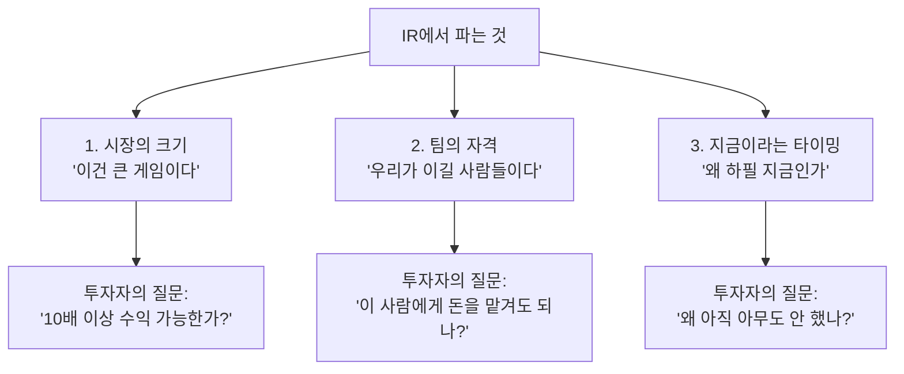
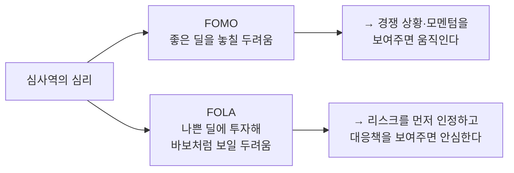
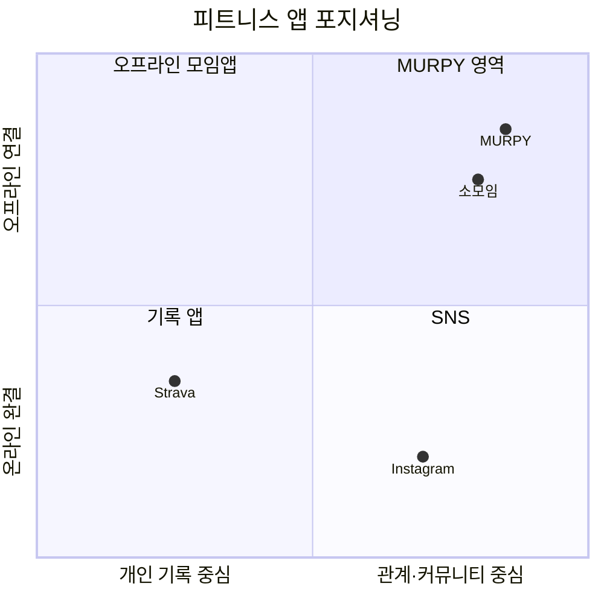
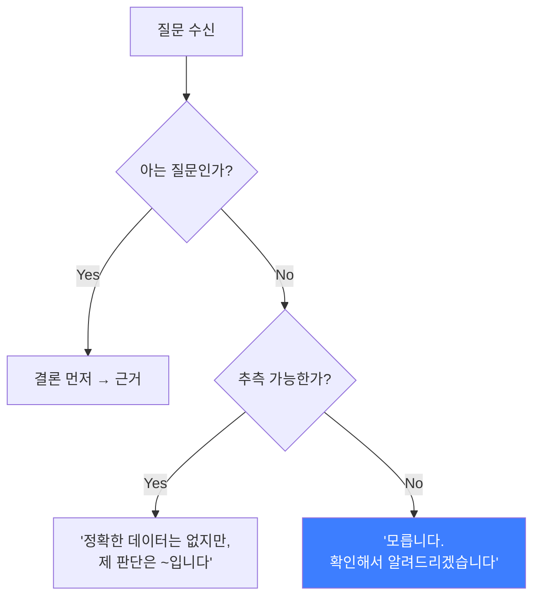

# 03. IR MASTER — IR·피치덱·발표 완전 가이드

> **문서 상태:** v1.0 (2026-07-21)
> **관계:** [[02_VC_MASTER]]가 "투자 거래의 구조"를 다룬다면, 이 문서는 "그 거래를 시작시키는 커뮤니케이션"을 다룬다. 실제 발표 자료 산출물은 `ir/` 폴더에 축적한다.

---

## Executive Summary

IR(Investor Relations)의 목적은 흔히 오해된다. **피치의 목적은 투자를 받는 것이 아니라, 다음 미팅을 잡는 것이다.**

첫 미팅에서 투자가 결정되는 경우는 거의 없다. 첫 미팅의 유일한 목적은 심사역이 "이 회사, 파트너 미팅에 올려볼 만하다"고 생각하게 만드는 것이다. 이 관점 전환이 피치덱 설계 전체를 바꾼다 — 모든 것을 설명하려 하지 말고, **더 알고 싶게 만들어야 한다.**

MURPY의 IR에는 다른 스타트업에 없는 고유한 강점과 고유한 함정이 동시에 있다.

**강점:** 실제로 작동하는 앱을 그 자리에서 보여줄 수 있다. 대표가 247명 커뮤니티를 직접 운영한 당사자다. 이 두 가지는 슬라이드 100장보다 강력하다.

**함정:** MURPY는 기능이 많다. 홈·매칭·대숲·스쿼드·머피월드·센터가 전부 있다. 이것을 순서대로 설명하면 **"뭘 하는 회사인지 모르겠다"**는 최악의 반응이 나온다. `MURPY_사업_설명서_최종본.md` 30장의 Q1이 정확히 이 지점을 인지하고 있다 — IR에서는 이 위험이 몇 배로 커진다.

따라서 MURPY IR의 핵심 원칙은 하나다:

> **기능을 나열하지 말고, 하나의 순환(loop)을 보여준다.**

---

## 목차

1. IR의 본질 — 무엇을 파는가
2. 투자자의 심리 구조
3. 피치덱 표준 구조
4. 슬라이드별 작성 가이드
5. MURPY 피치덱 설계
6. 원페이저
7. 데모 영상
8. 스토리텔링 프레임워크
9. 3분 피치
10. 5분 피치
11. 10분 피치
12. 20분 피치
13. 발표 기술
14. Q&A 대응 원칙
15. 투자자 반론 유형과 대응
16. 이메일·콜드아웃리치
17. 데이터룸 구성
18. 흔한 실수
19. 체크리스트
20. 부록·향후 확장

---

## 1. IR의 본질 — 무엇을 파는가

### 1.1 창업자는 세 가지를 판다



### 1.2 투자자가 실제로 듣고 싶은 것

투자자는 제품 설명을 원하지 않는다. **투자 논리(investment thesis)**를 원한다.

| 창업자가 말하는 것 | 투자자가 원하는 것 |
|---|---|
| "우리 앱에는 6개 탭이 있습니다" | "이 회사가 왜 10배 성장하는가" |
| "이 기능이 정말 잘 만들어졌습니다" | "그 기능이 어떤 지표를 움직이는가" |
| "경쟁사보다 UI가 좋습니다" | "복제 불가능한 이유가 무엇인가" |
| "열심히 하겠습니다" | "무엇을 어떻게 검증했는가" |

---

## 2. 투자자의 심리 구조

### 2.1 심사역의 하루

VC 심사역은 주당 수십 개의 덱을 본다. 대부분은 몇 분 안에 판단된다. 이 현실이 의미하는 것:

- **첫 3장 안에 "무엇을 하는 회사인지" 이해되지 않으면 끝난다**
- 텍스트가 빽빽하면 읽지 않는다
- 한 장에 하나의 메시지만 있어야 한다

### 2.2 심사역의 두 가지 두려움



**실무 시사점:**
- 리스크를 숨기면 오히려 의심받는다. **먼저 인정하고 대응책을 제시**하는 것이 신뢰를 만든다.
- MURPY의 경우: 1인 체제, 데이터 부재, 소개팅 앱 오인 위험 — 이 세 가지를 먼저 말하고 대응을 보여주는 것이 낫다.

### 2.3 심사역은 내부 설득자가 된다

투자 결정은 심사역 혼자 못 한다. 심사역은 파트너 회의에서 **당신을 대신해 발표**해야 한다. 따라서:

> **당신의 피치덱은 심사역이 다른 사람에게 설명할 때 쓸 무기여야 한다.**

이것은 실용적 함의를 갖는다 — 덱은 **당신 없이 읽혀도 이해되어야 한다.** 발표용 덱(시각 중심)과 전달용 덱(설명 포함)을 구분해서 준비하는 이유다.

---

## 3. 피치덱 표준 구조

### 3.1 표준 10~12장 구성

| # | 슬라이드 | 핵심 질문 | 실패 패턴 |
|---|---|---|---|
| 1 | 커버 | 한 문장으로 뭐 하는 회사인가 | 로고만 크게 |
| 2 | 문제 | 누가 얼마나 아픈가 | 일반론 나열 |
| 3 | 해결책 | 어떻게 푸는가 | 기능 목록 |
| 4 | 제품 | 실제로 어떻게 생겼나 | 스크린샷 남발 |
| 5 | 시장 | 얼마나 큰가 | 근거 없는 TAM |
| 6 | 비즈니스 모델 | 어떻게 돈 버나 | 수익원 8개 나열 |
| 7 | 트랙션 | 증거가 있나 | 허영 지표 |
| 8 | 경쟁 | 왜 우리가 이기나 | 우리만 다 ✅인 표 |
| 9 | GTM | 어떻게 성장하나 | "바이럴로" |
| 10 | 팀 | 왜 당신들인가 | 이력 나열 |
| 11 | 재무 | 숫자가 말이 되나 | 하키스틱 |
| 12 | Ask | 얼마를 어디에 쓰나 | 금액만 |

### 3.2 슬라이드 설계 원칙

- **한 장 = 한 메시지**
- **제목이 결론이어야 한다** ("시장 규모"가 아니라 "국내 스포츠산업 84.7조, 우리는 그 접점을 연결한다")
- **글자보다 그림**
- **숫자에는 반드시 출처**

---

## 4. 슬라이드별 작성 가이드

### 4.1 문제 슬라이드

**나쁜 예:** "현대인은 운동을 지속하기 어렵습니다."
→ 너무 일반적. 누구나 아는 사실.

**좋은 예:** 구체적 인물과 상황
> "247명 규모 운동 크루를 카카오톡 오픈채팅으로 운영하면, 공지는 묻히고 출석은 수기로 세고 회비는 엑셀로 관리한다. 크루장은 매주 3시간을 운영에 쓴다."

**원칙: 문제는 데이터가 아니라 장면으로 보여준다.** MURPY는 대표가 그 장면의 당사자였다는 점이 결정적 강점이다.

### 4.2 해결책 슬라이드

기능 목록이 아니라 **전환(before → after)**을 보여준다.

```
Before: 오픈채팅 + 엑셀 + 수기 출석 + 흩어진 인증
After:  하나의 앱에서 인증 → 보상 → 관계 → 재운동
```

### 4.3 시장 슬라이드

**절대 하면 안 되는 것:** "시장이 84조입니다. 우리가 1%만 먹어도 8,400억입니다."
→ VC가 가장 싫어하는 논리. 즉시 신뢰를 잃는다.

**해야 하는 것:** Bottom-up 계산
```
초기 타깃 지역 규칙적 운동 인구 × 핵심 연령 비중 × 서비스 적합률 = SAM
실제 확보 가능한 센터 수 × 센터당 예상 활성 사용자 = SOM
```

`MURPY_사업_설명서_최종본.md` 19.3장이 이미 이 구조를 갖추고 있다 — 그대로 활용하되 **숫자 출처를 슬라이드에 명시**할 것.

### 4.4 트랙션 슬라이드 — 가장 중요한 장

**허영 지표(Vanity Metrics) vs 실제 지표**

| 허영 지표 | 실제 지표 |
|---|---|
| 누적 가입자 수 | 주간 활성 사용자 |
| 앱 다운로드 | D30 리텐션 |
| SNS 팔로워 | 재방문율 |
| 총 게시글 수 | 사용자당 주간 활동 수 |

> **MURPY 현실:** 지금은 보여줄 코호트 데이터가 없다. 이 경우 **정성적 트랙션**으로 대체한다 — GBD CREW 247명의 실존, 실제 운영 사례, 초기 사용자 인터뷰 인용. 단, **없는 데이터를 지어내지 않는다.** "아직 측정 전"이라고 말하는 것이 조작된 숫자보다 100배 낫다.

### 4.5 경쟁 슬라이드

**나쁜 예:** 우리만 전 항목 ✅인 비교표 → 아무도 안 믿는다.

**좋은 예:** 2×2 포지셔닝 맵 또는 **경쟁사의 강점을 인정한 뒤 우리가 다른 축에 있음을 보여주는 것**



### 4.6 Ask 슬라이드

**금액만 쓰면 안 된다.** 반드시 세 가지를 함께:

1. 얼마를 (금액)
2. 어디에 (용도 배분 — 개발 X%, 마케팅 Y%, 운영 Z%)
3. 무엇을 달성하려고 (이 자금으로 도달할 마일스톤)

---

## 5. MURPY 피치덱 설계

### 5.1 MURPY 덱의 핵심 전략 — "루프 하나로 승부"

MURPY의 최대 리스크는 복잡성이다. 해결책은 **모든 슬라이드가 하나의 루프로 수렴**하게 만드는 것.


이 그림 한 장이 MURPY 덱의 **중심축**이다. 모든 기능 설명은 "이 루프의 어느 단계인가"로만 언급한다.

- 홈 = 인증 단계
- 매칭/대숲 = 관계 단계
- 머피월드 = 보상·정체성 단계
- 센터 = 루프가 발생하는 물리적 장소
- 스쿼드 = 루프를 여러 명이 함께 도는 형태

### 5.2 MURPY 덱 슬라이드 구성안

| # | 슬라이드 | MURPY 내용 |
|---|---|---|
| 1 | 커버 | "MURPY — 운동을 관계와 자산으로 바꾸는 피트니스 소셜 플랫폼" |
| 2 | 문제 | 247명 크루를 오픈채팅으로 운영하는 현실 (대표 경험) |
| 3 | 인사이트 | 운동은 반복 행동 + 정체성 표현 + 지역 관계 (`사업설명서` 2장) |
| 4 | 해결책 = 루프 | 위 루프 다이어그램 한 장 |
| 5 | 제품 데모 | **실제 앱 시연** (스크린샷 아님) |
| 6 | 왜 지금인가 | 오운완 문화, 러닝크루 성장, AI 자산 생산비 하락 (19.4장) |
| 7 | 시장 | Bottom-up SAM/SOM (19.3장) |
| 8 | 비즈니스 모델 | **초기 집중 1~2개만** (PRO + 프리미엄 센터) |
| 9 | 해자 | 머피에셋스튜디오 + 센터 로컬 그래프 (21장) |
| 10 | 트랙션 | GBD CREW + 제품 완성도 (데이터 확보 후 교체) |
| 11 | 팀 | Founder-Market Fit (26장) + 채용 계획 |
| 12 | 로드맵 | Phase 1~5 (25장) |
| 13 | Ask | 금액 + 용도 + 마일스톤 |

### 5.3 MURPY 덱에서 절대 하지 말아야 할 것

- ❌ 6개 탭을 순서대로 설명하기
- ❌ 수익모델 6개를 모두 나열하기
- ❌ "소개팅 앱 아닙니다"를 방어적으로 반복하기 (한 번만 명확히, 그 다음은 제품으로 증명)
- ❌ 머피월드를 게임처럼 소개하기 (리텐션 엔진으로 포지셔닝)
- ❌ 캐릭터 아트를 너무 많이 보여주기 (귀엽지만 투자 논리가 아님)

---

## 6. 원페이저

### 6.1 용도

- 콜드 이메일 첨부
- 미팅 후 남기는 자료
- 소개받을 때 중개자가 전달하는 자료

### 6.2 원페이저 구성 (A4 1장)

```
┌─────────────────────────────────────┐
│ 로고 + 한 문장 정의                    │
├─────────────────────────────────────┤
│ 문제 (2~3줄)                         │
│ 해결책 (2~3줄 + 루프 다이어그램)        │
├──────────────────┬──────────────────┤
│ 시장 규모          │ 비즈니스 모델      │
├──────────────────┼──────────────────┤
│ 트랙션            │ 팀                │
├─────────────────────────────────────┤
│ Ask + 연락처                          │
└─────────────────────────────────────┘
```

**원칙: 30초 안에 읽힌다.**

---

## 7. 데모 영상

### 7.1 왜 MURPY에게 특히 중요한가

MURPY는 **말로 설명하면 복잡하고, 보면 즉시 이해되는** 유형의 제품이다. 캐릭터가 움직이고, 스쿼드 룸에서 여러 명이 함께 걷고, 인증하면 머피가 쌓이는 장면은 슬라이드로 전달 불가능하다.

### 7.2 데모 영상 구성 (60~90초)

| 시간 | 내용 |
|---|---|
| 0~10초 | 문제 상황 (오픈채팅 캡처 등) |
| 10~30초 | 운동 인증 → 머피 획득 → 축하 연출 |
| 30~50초 | 캐릭터 꾸미기 → 머피 CAM 공유 |
| 50~70초 | 스쿼드 룸에서 여러 캐릭터가 함께 걷는 장면 |
| 70~90초 | 센터 도감·배지 수집 |

### 7.3 제작 원칙

- 실제 앱 화면으로 (목업 금지)
- 자막 필수 (음소거로 보는 경우가 많음)
- 처음 5초에 가장 인상적인 장면
- 로딩·버벅임 없는 매끄러운 녹화

> **실행 항목:** 데모 영상 스크립트와 실제 파일은 `ir/` 폴더에 보관.

---

## 8. 스토리텔링 프레임워크

### 8.1 프레임워크 A — 영웅의 여정 (창업 스토리형)

```
평범한 일상 → 문제와의 조우 → 기존 해법의 실패 → 발견 → 새로운 세계
```

**MURPY 적용:**
> "저는 트레이너였고, 247명 운동 크루를 운영했습니다. 매주 오픈채팅에서 공지가 묻히고, 출석은 손으로 세고, 회비는 엑셀로 관리했습니다. 앱을 찾아봤지만 기록 앱은 관계가 없었고, 모임 앱은 운동을 몰랐습니다. 그래서 직접 만들기 시작했습니다."

### 8.2 프레임워크 B — Before/After/Bridge

| Before | After | Bridge |
|---|---|---|
| 흩어진 운동 활동 | 하나의 루프로 연결된 운동생활 | MURPY |

### 8.3 프레임워크 C — What/Why Now/Why Us

투자자가 가장 빠르게 이해하는 구조. 3분 피치에 최적.

### 8.4 MURPY 스토리의 핵심 자산

**대표 본인이 스토리다.** 이것은 대부분의 창업자가 갖지 못한 자산이다.
- 트레이너 경력 → 도메인 이해
- 247명 운영 → 문제의 당사자
- 직접 개발 → 실행력 증명

이 세 가지를 30초 안에 전달하는 것이 MURPY IR의 출발점이다.

---

## 9. 3분 피치

### 9.1 용도
네트워킹 이벤트, 엘리베이터 피치, 데모데이 예선

### 9.2 구조 (3분 = 약 450~500자 발화)

| 시간 | 내용 | 분량 |
|---|---|---|
| 0:00~0:20 | 한 문장 정의 + 자기소개 | 2문장 |
| 0:20~0:50 | 문제 (본인 경험) | 3문장 |
| 0:50~1:30 | 해결책 = 루프 | 4문장 |
| 1:30~2:00 | 왜 우리인가 | 2문장 |
| 2:00~2:30 | 시장 + 비즈니스 모델 | 3문장 |
| 2:30~3:00 | 현재 상태 + Ask | 2문장 |

### 9.3 MURPY 3분 피치 스크립트 (초안)

> "MURPY는 운동을 관계와 디지털 자산으로 바꾸는 피트니스 소셜 플랫폼입니다. 저는 퍼스널 트레이너이자 247명 운동 크루의 운영자입니다.
>
> 크루를 운영하면서 매주 같은 문제를 겪었습니다. 공지는 오픈채팅에서 묻히고, 출석은 수기로 세고, 같은 헬스장에 다니는 사람들끼리도 서로를 모릅니다. 운동 기록 앱은 관계를 만들지 못하고, 모임 앱은 운동을 이해하지 못합니다.
>
> MURPY는 하나의 순환을 만듭니다. 운동하고, 인증하고, 머피라는 보상을 받고, 캐릭터를 꾸미고, 그것을 자랑하면서 같은 센터 사람들과 연결되고, 다시 함께 운동합니다. 이 루프가 돌수록 사용자에게는 기록과 캐릭터와 관계가 쌓이고, 헬스장에는 신규 방문자와 후기가 쌓입니다.
>
> 저는 이 문제를 관찰한 게 아니라 직접 겪었고, 제품도 직접 만들었습니다. 지금 실제로 작동하는 앱이 있습니다.
>
> 국내 스포츠산업은 84조 원 규모이고, 국민의 62.9%가 규칙적으로 운동합니다. 우리는 사용자에게는 구독과 디지털 아이템으로, 헬스장에는 노출과 방문 유입으로 수익을 만듭니다.
>
> 현재 GBD 크루를 대상으로 베타를 준비 중이고, 리텐션 검증 이후 정부지원과 초기 투자를 계획하고 있습니다."

**주의:** 위 스크립트의 통계 수치는 `사업설명서` 32장의 출처를 따른다. 발표 전 최신 통계로 갱신 확인 필요.

---

## 10. 5분 피치

3분 피치 + 다음 요소 추가:

- **제품 데모 30초** (실제 화면)
- **경쟁 포지셔닝 30초**
- **트랙션 상세 30초**
- **팀/채용 계획 30초**

### 5분 피치의 함정
5분은 "조금 더 말할 수 있다"는 착각을 준다. 실제로는 **3분 내용을 더 명확하게 전달하는 것**이 낫다. 새 내용을 욱여넣지 말 것.

---

## 11. 10분 피치

### 11.1 구조

| 구간 | 시간 | 내용 |
|---|---|---|
| 도입 | 1분 | 정의 + 창업자 스토리 |
| 문제 | 1.5분 | 구체적 장면 + 시장의 크기 |
| 해결책 | 2분 | 루프 + 제품 데모 |
| 시장 | 1분 | Bottom-up 산정 |
| 비즈니스 모델 | 1.5분 | 초기 집중 모델 + 단위경제 |
| 경쟁·해자 | 1.5분 | 포지셔닝 + 복제 난이도 |
| 팀·트랙션 | 1분 | Founder-Market Fit |
| 로드맵·Ask | 0.5분 | 마일스톤 + 요청 |

### 11.2 10분에서 반드시 넣어야 할 것

**단위경제(Unit Economics)의 논리.** 10분부터는 "이게 사업이 되는가"를 숫자로 물어본다. 실제 데이터가 없다면 **가정과 검증 계획**이라도 제시해야 한다. ([[05_KPI_MASTER]] 참조)

---

## 12. 20분 피치

### 12.1 용도
정식 IR 미팅, TIPS 발표평가, 데모데이 본선

### 12.2 20분 구조의 핵심 차이

10분 피치가 "설득"이라면 20분은 **"검증을 견디는 것"**이다. 다음이 추가된다:

- 상세 재무 모델 (3년)
- 리스크와 대응책 (`사업설명서` 29장)
- 구체적 실행 계획 (분기별 마일스톤)
- 자금 사용 상세 계획
- 조직 구성 계획

### 12.3 TIPS 발표평가 특화 조정

[[01_TIPS_MASTER]] 12.2장과 연동. 정부 심사는 VC와 다른 것을 본다:

| VC가 보는 것 | 정부 심사가 보는 것 |
|---|---|
| 10배 성장 가능성 | 기술의 독창성 |
| 시장 지배 시나리오 | 사업화 실현 가능성 |
| 엑싯 가능성 | 고용·산업 파급효과 |
| 팀의 야망 | 계획의 구체성·실현성 |

**따라서 TIPS 발표에서는 기술 파이프라인(머피에셋스튜디오, 실시간 동기화 구조)에 더 많은 시간을 배분**해야 한다.

---

## 13. 발표 기술

### 13.1 물리적 준비

- [ ] 데모 기기 완충 + 예비 기기
- [ ] 네트워크 실패 대비 (오프라인 영상 백업 필수)
- [ ] 화면 공유 사전 테스트
- [ ] 발표 자료 PDF 백업 (폰트 깨짐 방지)

### 13.2 발화 원칙

| 원칙 | 이유 |
|---|---|
| 천천히 말한다 | 긴장하면 빨라진다. 의식적으로 늦춰야 정상 속도 |
| 숫자는 강조해서 | "이십사만" 같은 숫자는 흘려들으면 안 들린다 |
| 슬라이드를 읽지 않는다 | 읽을 거면 보낼 것이지 왜 만났나 |
| 침묵을 두려워하지 않는다 | 질문 후 3초 생각하는 것이 즉답보다 신뢰를 준다 |

### 13.3 리허설 방법

1. **혼자 3회** — 시간 측정, 스크립트 안정화
2. **녹화 1회** — 자기 발표 보기 (가장 효과적, 가장 하기 싫음)
3. **비전문가 앞 1회** — 도메인 모르는 사람이 이해하는지
4. **전문가 앞 1회** — 날카로운 질문 받기

---

## 14. Q&A 대응 원칙

### 14.1 기본 원칙



**"모릅니다"는 감점이 아니라 가점이다.** 모르는 것을 아는 척하다 걸리는 것이 최악이다.

### 14.2 답변 구조 — PREP

- **P**oint (결론)
- **R**eason (이유)
- **E**xample (사례)
- **P**oint (결론 재확인)

### 14.3 하지 말아야 할 반응

- 방어적 태도 ("그건 아니고요...")
- 질문자와 논쟁
- 장황한 답변 (30초 이내 원칙)
- 다른 질문에 답하기 (질문 회피로 읽힘)

---

## 15. 투자자 반론 유형과 대응

> 상세 100문항은 [[08_INVESTOR_FAQ]] 참조. 여기서는 **MURPY가 가장 많이 받을 핵심 반론 8개**만 다룬다.

### 반론 1: "기능이 너무 많은데요?"

**나쁜 답변:** "각 기능이 다 필요해서요."

**좋은 답변:**
> "맞습니다, 겉으로 보면 많습니다. 하지만 기능이 아니라 하나의 루프입니다. 운동→인증→보상→꾸미기→관계→재운동. 각 화면은 이 루프의 한 구간입니다. 초기 검증은 이 루프의 첫 한 바퀴, 즉 7일 Activation에 집중합니다."

### 반론 2: "소개팅 앱 아닌가요?"

**좋은 답변:**
> "매칭 기능이 있지만 '좋아요'가 아니라 '같이 운동해요'입니다. 연결의 근거가 외모가 아니라 운동 종목·센터·인증 기록입니다. 그리고 소개팅 앱은 매칭되면 이탈하지만, MURPY는 매칭 이후 함께 운동하면서 리텐션이 올라갑니다. 구조가 반대입니다."

### 반론 3: "Strava가 이거 하면 어떡하죠?"

**좋은 답변:**
> "Strava는 기록 중심이고 개인 성과 트래킹이 핵심입니다. 우리는 지역 센터 단위의 관계 밀도가 핵심입니다. Strava가 이 방향으로 오려면 로컬 센터 제휴와 오프라인 네트워크를 처음부터 쌓아야 하는데, 그건 기능 개발이 아니라 영업의 문제입니다. 그리고 우리는 이미 247명 크루라는 초기 밀도를 갖고 시작합니다."

### 반론 4: "혼자 하시는 거죠?"

**좋은 답변 (숨기지 않는다):**
> "네, 현재 1인입니다. 이게 가장 큰 리스크라고 생각합니다. 다만 지금까지 혼자서 실사용 가능한 앱을 만들었고, 이건 실행력의 증거이기도 합니다. 이번 자금의 최우선 용도가 개발자와 B2B 영업 인력 채용입니다. 구체적으로 어떤 역할을 언제 뽑을지는 계획이 있습니다."

### 반론 5: "리텐션 데이터가 없네요?"

**좋은 답변:**
> "정확합니다. 아직 없습니다. 그래서 지금 GBD 크루 247명을 대상으로 베타를 시작하려 합니다. 검증하려는 가설은 명확합니다 — 7일 안에 인증·보상·꾸미기·사회적 행동을 모두 경험한 사용자의 D30이 그렇지 않은 사용자보다 유의하게 높은가. 이 데이터를 3개월 안에 만들어서 다시 뵙고 싶습니다."

### 반론 6: "헬스장이 왜 돈을 내죠?"

**좋은 답변:**
> "노출을 사는 게 아니라 측정 가능한 방문을 삽니다. 우리는 상세 조회 → 일일권 클릭 → 실제 체크인까지의 전환을 추적합니다. 파일럿을 무료로 돌리고 이 숫자를 보여준 뒤 유료로 전환하는 구조입니다. 헬스장이 가장 원하는 건 신규 방문자이고, 원정운동 사용자는 일일권을 실제로 결제하는 고관여 고객입니다."

### 반론 7: "시장이 너무 니치한 것 아닌가요?"

**좋은 답변:**
> "피트니스로 좁게 시작하지만 구조는 종목 확장이 가능합니다. 이미 헬스·러닝·골프·테니스·클라이밍·하이록스·등산 7종으로 설계되어 있습니다. 핵심은 종목이 아니라 '반복되는 신체 활동 + 지역 기반 관계'라는 구조이고, 이건 요가·필라테스·수영·라이딩으로 그대로 확장됩니다."

### 반론 8: "캐릭터 꾸미기가 왜 필요하죠?"

**좋은 답변:**
> "운동은 결과가 눈에 잘 안 보입니다. 3개월 해도 사진으로는 티가 안 나죠. 캐릭터는 그 노력을 즉시 보이는 형태로 바꿔줍니다. 그리고 이건 리텐션 장치이면서 동시에 수익 모델이고, 브랜드가 실제 상품을 디지털로 입점시키는 채널이기도 합니다. 하나의 기능이 세 가지 역할을 합니다."

---

## 16. 이메일·콜드아웃리치

### 16.1 콜드 이메일 구조 (5줄 원칙)

```
1줄: 누구인지 + 왜 당신에게 연락했는지 (구체적 이유)
2줄: 한 문장 회사 정의
3줄: 가장 강한 트랙션 1개
4줄: 요청 (15분 통화)
5줄: 첨부 (원페이저)
```

### 16.2 나쁜 콜드 이메일의 특징

- 수신자 이름 없음 / 잘못된 이름
- "혁신적인", "게임 체인저" 같은 형용사
- 첨부 파일 5개
- 본문 3문단 이상
- 왜 이 투자자인지 설명 없음 (대량 발송 티가 남)

### 16.3 웜 인트로가 훨씬 효과적이다

콜드 이메일 응답률은 낮다. **소개(warm intro)를 받는 것이 몇 배 효과적**이다.

MURPY의 소개 경로 후보:
- 액셀러레이터 배출 기업 창업자
- 피트니스 업계 인맥 중 투자자와 연결된 인물
- 정부지원사업 멘토·심사위원
- 대학·커뮤니티 네트워크

---

## 17. 데이터룸 구성

실사 단계([[02_VC_MASTER]] 11장)에서 요구되는 자료를 미리 정리해둔 폴더.

```
데이터룸/
├── 01_회사/          법인등기부, 정관, 주주명부
├── 02_재무/          재무제표, 세무신고, 자금계획
├── 03_제품/          제품 소개, 기술 문서, 로드맵
├── 04_시장/          시장 조사, 경쟁 분석
├── 05_지표/          코호트 데이터, KPI 대시보드
├── 06_법률/          계약서, 개인정보처리방침, 이용약관
├── 07_IP/            상표·특허 출원 현황
└── 08_팀/            이력서, 조직도, 채용 계획
```

> **실행 항목:** 이 구조를 `ir/데이터룸/`에 미리 만들어두고 채워나간다. 실사 요청받고 나서 준비하면 늦다.

---

## 18. 흔한 실수

| 실수 | 왜 치명적인가 | 해결 |
|---|---|---|
| 제품 설명에 시간 대부분 사용 | 투자 논리가 안 보임 | 제품은 데모로, 시간은 논리에 |
| 경쟁사 없다고 주장 | 시장이 없거나 조사를 안 했다는 뜻 | 반드시 경쟁 인정 |
| 하키스틱 재무 예측 | 근거 없으면 신뢰 하락 | 가정을 명시 |
| 시장 1% 논리 | 즉시 아마추어로 판정 | Bottom-up |
| 질문에 방어적 대응 | 팀워크 우려 | 인정 → 대응책 |
| 리스크 숨기기 | 실사에서 드러나면 신뢰 붕괴 | 먼저 밝히기 |
| 덱을 매번 처음부터 다시 만들기 | 시간 낭비 | 버전 관리 (`ir/`) |
| 피드백을 반영 안 함 | 같은 지적 반복 | 미팅 후 즉시 수정 |

---

## 19. 체크리스트

### 덱 완성 체크
- [ ] 첫 3장 안에 뭐 하는 회사인지 이해되는가
- [ ] 한 장에 한 메시지인가
- [ ] 제목이 결론 문장인가
- [ ] 모든 숫자에 출처가 있는가
- [ ] 루프 다이어그램이 중심에 있는가
- [ ] 발표자 없이 읽어도 이해되는 버전이 있는가

### 미팅 전
- [ ] 투자자 배경 리서치 완료
- [ ] 3/5/10/20분 버전 준비
- [ ] 데모 환경 점검 + 오프라인 백업
- [ ] 예상 질문 리허설
- [ ] 원페이저 준비

### 미팅 후
- [ ] 24시간 내 감사 메일 + 요청 자료 전송
- [ ] 받은 질문 중 답 못 한 것 정리해서 회신
- [ ] 피드백을 덱에 반영
- [ ] `ir/` 폴더에 미팅 노트 기록

---

## 20. 부록

### 20.1 관련 문서

- [[01_TIPS_MASTER]] — TIPS 발표평가 특화 대응
- [[02_VC_MASTER]] — 투자 구조·협상
- [[05_KPI_MASTER]] — 트랙션 슬라이드의 근거
- [[08_INVESTOR_FAQ]] — 반론 100문항 확장판
- `MURPY_사업_설명서_최종본.md` — 모든 슬라이드의 원자료
- `ir/` 폴더 — 실제 산출물

### 20.2 향후 확장

- [ ] 실제 피치덱 v1 제작 후 `ir/`에 저장, 이 문서 5.2장과 연결
- [ ] 데모 영상 스크립트 확정 후 `ir/`에 저장
- [ ] 실제 미팅 피드백 누적 후 15장의 반론 목록 확장
- [ ] TIPS 발표평가 실제 질문 확보 후 12.3장 보강
- [ ] 원페이저 템플릿을 `templates/`에 추가
- [ ] 데이터룸 폴더 구조 실제 생성 및 채우기

---

이전: [[02_VC_MASTER]] · 다음: [[04_PATENT_MASTER]]
